Yelp\_Hotels\_Topic\_Modeling\_and\_ANOVA
================
Michael Mazel
2/19/2021

``` r
library(R.utils)
```

    ## Loading required package: R.oo

    ## Loading required package: R.methodsS3

    ## R.methodsS3 v1.8.1 (2020-08-26 16:20:06 UTC) successfully loaded. See ?R.methodsS3 for help.

    ## R.oo v1.24.0 (2020-08-26 16:11:58 UTC) successfully loaded. See ?R.oo for help.

    ## 
    ## Attaching package: 'R.oo'

    ## The following object is masked from 'package:R.methodsS3':
    ## 
    ##     throw

    ## The following objects are masked from 'package:methods':
    ## 
    ##     getClasses, getMethods

    ## The following objects are masked from 'package:base':
    ## 
    ##     attach, detach, load, save

    ## R.utils v2.10.1 (2020-08-26 22:50:31 UTC) successfully loaded. See ?R.utils for help.

    ## 
    ## Attaching package: 'R.utils'

    ## The following object is masked from 'package:utils':
    ## 
    ##     timestamp

    ## The following objects are masked from 'package:base':
    ## 
    ##     cat, commandArgs, getOption, inherits, isOpen, nullfile, parse,
    ##     warnings

``` r
library(rjson)
library(plyr)
library(dplyr) 
```

    ## 
    ## Attaching package: 'dplyr'

    ## The following objects are masked from 'package:plyr':
    ## 
    ##     arrange, count, desc, failwith, id, mutate, rename, summarise,
    ##     summarize

    ## The following objects are masked from 'package:stats':
    ## 
    ##     filter, lag

    ## The following objects are masked from 'package:base':
    ## 
    ##     intersect, setdiff, setequal, union

``` r
library(tidyverse)
```

    ## -- Attaching packages --------------------------------------- tidyverse 1.3.0 --

    ## v ggplot2 3.3.3     v purrr   0.3.4
    ## v tibble  3.0.4     v stringr 1.4.0
    ## v tidyr   1.1.2     v forcats 0.5.0
    ## v readr   1.4.0

    ## -- Conflicts ------------------------------------------ tidyverse_conflicts() --
    ## x dplyr::arrange()   masks plyr::arrange()
    ## x purrr::compact()   masks plyr::compact()
    ## x dplyr::count()     masks plyr::count()
    ## x tidyr::extract()   masks R.utils::extract()
    ## x dplyr::failwith()  masks plyr::failwith()
    ## x dplyr::filter()    masks stats::filter()
    ## x dplyr::id()        masks plyr::id()
    ## x dplyr::lag()       masks stats::lag()
    ## x dplyr::mutate()    masks plyr::mutate()
    ## x dplyr::rename()    masks plyr::rename()
    ## x dplyr::summarise() masks plyr::summarise()
    ## x dplyr::summarize() masks plyr::summarize()

``` r
library(stringr)
library(webshot)
```

    ## Warning: package 'webshot' was built under R version 4.0.4

# Importing and Filtering for Only Hotels

The comments below show the original import method for the Yelp Review
and Yelp Business files. We also filtered for reviews by the hotel
category. This reduced the number of reviews from 8mil to 400k. A local
copy was then saved for ease of time, as the importing steps can take
awhile.

``` r
#tr.business <- "your_path_here//yelp_academic_dataset_business.json"
#con <- file(tr.business, "r")
#input <- readLines(con, -1L)
#close(con)
#tr.business <- ldply(lapply(input, function(x) t(unlist(fromJSON(x)))))
#save(tr.business, file= 'tr.business')

#tr.review <- "your_path_here///yelp_academic_dataset_review.json"
#con <- file(tr.review, "r")
#input <- readLines(con, -1L)
#close(con)
#tr.review <- ldply(lapply(input, function(x) t(unlist(fromJSON(x)))))
#save(tr.review, file= 'tr.review.rdata')

#hotels <- merge(x = tr.business, y = tr.review)
#hotels <- hotels[str_detect(hotels$categories, regex("hotel", ignore_case = TRUE)), ]
#write.csv(hotels, file="hotels")

hotels_raw <- read.csv(file.choose(),header = TRUE)
```

Eliminate clutter variables. Keep business name, text (aka review),
stars, categories, city, state, date. Then, shuffle the rows.

``` r
hotel_all <- hotels_raw %>% dplyr::select(3, 66, 19, 62, 5, 6, 67)

set.seed(123)
hotel_all <- hotel_all[sample(nrow(hotel_all)), ]
```

We suspect that we can remove anything that does not include the exact
subcategory “Hotels”. For example, remove a row if the category does not
contain “Hotels” but it contains “Hotels & Travel”. The code below shows
what column we believe we can remove

``` r
hotel_all %>% filter(str_detect(hotel_all$categories, regex(", Hotels,", ignore_case = TRUE)) == F) %>% distinct(name) %>% head(50)
```

    ##                                                       name
    ## 1                      Arizona Collision Center of Phoenix
    ## 2                                          Spirit Airlines
    ## 3                                      Smart Motors Toyota
    ## 4                              Sun Buggy & ATV Fun Rentals
    ## 5                                          Porter Airlines
    ## 6                 Drury Inn & Suites - Charlotte Northlake
    ## 7                                       Fat Head's Brewery
    ## 8                                               Bell Trans
    ## 9                                                   Encore
    ## 10                                       Hôtel le Crystal
    ## 11                                           Safeway Tours
    ## 12                                         Passport Health
    ## 13                                               Zinburger
    ## 14                              The Signature at MGM Grand
    ## 15                                          Bellagio Hotel
    ## 16                            Rio All-Suite Hotel & Casino
    ## 17                                        Rustler's Rooste
    ## 18                                Marriott's Grand Chateau
    ## 19                                       Budget Car Rental
    ## 20                                                 3 Palms
    ## 21                   Toronto Pearson International Airport
    ## 22                                 Omni William Penn Hotel
    ## 23                                El Cortez Hotel & Casino
    ## 24   Phoenix Sky Harbor International Airport - Terminal 4
    ## 25                                        Alamo Rent A Car
    ## 26                         Cuyahoga Valley Scenic Railroad
    ## 27                                         ARIA Poker Room
    ## 28                                                  Dollar
    ## 29                                               Green Cab
    ## 30                        Luxor Hotel and Casino Las Vegas
    ## 31                                    Advantage Rent A Car
    ## 32                                     Friedman Auto Lease
    ## 33                                    Talking Stick Resort
    ## 34                                        Planet Hollywood
    ## 35              Omni Scottsdale Resort & Spa at Montelucia
    ## 36                                       American Airlines
    ## 37                     Wolfgang Puck Bar & Grill Las Vegas
    ## 38                                            SuperShuttle
    ## 39                                               Bob Evans
    ## 40 Extended Stay America - Phoenix - Scottsdale - Old Town
    ## 41                                 Fred-Vincent Volkswagen
    ## 42   Bluegreen Vacations Club 36, Ascend Resort Collection
    ## 43                                      Southwest Airlines
    ## 44     DoubleTree By Hilton Hotel Pittsburgh - Monroeville
    ## 45                  Courtyard by Marriott Toronto Downtown
    ## 46                                               Lasxpress
    ## 47                                              Yellow Cab
    ## 48                             The LINQ Hotel + Experience
    ## 49           McCarran International Airport Terminal 1 - D
    ## 50                                    Relish Burger Bistro

This method successfully filters out non-hotels. Due to the commas in “,
Hotels,”, if “Hotels” is in the first or last position in the category
list, we would lose it. The code below fixes this issue and captures all
three of the potential positions.

``` r
str_end <- hotel_all[str_detect(str_sub(hotel_all$categories,-8,-1), regex(", Hotels", ignore_case = TRUE)), ]
str_beg <- hotel_all[str_detect(str_sub(hotel_all$categories,1,7), regex("Hotels,", ignore_case = TRUE)), ]
str_mid <- hotel_all[str_detect(hotel_all$categories, regex(", Hotels,", ignore_case = TRUE)), ]
hotel_all <- dplyr::union(str_beg,str_mid)
hotel_all <- dplyr::union(hotel_all,str_end)
```

Further investigation of categories and names we suspect we can filter
out

``` r
hotel_all[str_detect(hotel_all$categories, regex("Bus Tours", ignore_case = TRUE)), ] %>% distinct(name)
```

    ##                        name
    ## 1 Big Bus Tours - Las Vegas
    ## 2             Global Travel

``` r
hotel_all[str_detect(hotel_all$categories, regex("Steakhouses", ignore_case = TRUE)), ] %>% distinct(name)
```

    ##                                        name
    ## 1                          Santa Fe Station
    ## 2        Embassy Suites by Hilton Charlotte
    ## 3         Fiesta Henderson Hotel and Casino
    ## 4                         The Charcoal Room
    ## 5                             Hugo's Cellar
    ## 6          Boulder Station Hotel And Casino
    ## 7                      Sunset Station Bingo
    ## 8           Palace Station Hotel and Casino
    ## 9  Green Valley Ranch Resort Spa and Casino
    ## 10                  Jacobs & Co. Steakhouse
    ## 11                             Yukon Grille
    ## 12               Phil's Italian Steak House
    ## 13                            Sonoma Cellar
    ## 14                         Ron's Steakhouse
    ## 15                   Michael's Gourmet Room
    ## 16                   Binion's Gambling Hall
    ## 17                       Windsor Arms Hotel
    ## 18                  Amigo's Mexican Cantina
    ## 19                  Cabo Mexican Restaurant
    ## 20                      Fiesta Rancho Bingo
    ## 21                     The Range Steakhouse
    ## 22                                   Social
    ## 23                  Medici Cafe and Terrace
    ## 24          Costa Del Sol At Sunset Station
    ## 25                                   Buccis
    ## 26                     Roberta's Steakhouse
    ## 27                         Rustler's Rooste
    ## 28           LVH - Las Vegas Hotel & Casino
    ## 29                 Kokomo's Steak & Seafood
    ## 30               Arizona Grand Resort & Spa

``` r
hotel_all[str_detect(hotel_all$name, regex("Gourmet", ignore_case = TRUE)), ] %>% distinct(name)
```

    ##                     name
    ## 1 Michael's Gourmet Room

``` r
hotel_all[str_detect(hotel_all$name, regex("Bingo", ignore_case = TRUE)), ] %>% distinct(name)
```

    ##                           name
    ## 1         Sunset Station Bingo
    ## 2          Texas Station Bingo
    ## 3          Fiesta Rancho Bingo
    ## 4 Western Hotel & Bingo Parlor

``` r
hotel_all[str_detect(hotel_all$name, regex("Cantina", ignore_case = TRUE)), ] %>% distinct(name)
```

    ##                                      name
    ## 1 Hotel California Restaurant and Cantina
    ## 2                 Amigo's Mexican Cantina

``` r
hotel_all[str_detect(hotel_all$name, regex("Pub", ignore_case = TRUE)), ] %>% distinct(name)
```

    ##                        name
    ## 1 Fionn MacCool's Irish Pub
    ## 2      Peanuts Public House
    ## 3    The Senators Inn & Pub
    ## 4               O'Sheas Pub

``` r
hotel_all[str_detect(hotel_all$name, regex("Buffet", ignore_case = TRUE)), ] %>% distinct(name)
```

    ##                   name
    ## 1   The Buffet At Wynn
    ## 2 Corner Market Buffet
    ## 3          Lago Buffet
    ## 4  Garden Court Buffet
    ## 5        Bistro Buffet
    ## 6     Firelight Buffet

``` r
hotel_all[str_detect(hotel_all$name, regex("Steak", ignore_case = TRUE)), ] %>% distinct(name)
```

    ##                         name
    ## 1    Jacobs & Co. Steakhouse
    ## 2 Phil's Italian Steak House
    ## 3           Ron's Steakhouse
    ## 4       The Range Steakhouse
    ## 5       Roberta's Steakhouse
    ## 6   Kokomo's Steak & Seafood

``` r
hotel_all[str_detect(hotel_all$name, regex("Seafood", ignore_case = TRUE)), ] %>% distinct(name)
```

    ##                            name
    ## 1 Harbor Inn Seafood Restaurant
    ## 2      Kokomo's Steak & Seafood

``` r
hotel_all[str_detect(hotel_all$name, regex("Grill", ignore_case = TRUE)), ] %>% distinct(name)
```

    ##                                    name
    ## 1                          Yukon Grille
    ## 2                          Piñon Grill
    ## 3                             The Grill
    ## 4            Wicked Witches Bar & Grill
    ## 5                  Mr. D's Bar & Grille
    ## 6           The Tower Inn Bar and Grill
    ## 7  Laughing Jackalope Motel Bar & Grill
    ## 8                        Lantana Grille
    ## 9                      Michael's Grille
    ## 10             Graze Restaurant & Grill

``` r
hotel_all[str_detect(hotel_all$name, regex("Cafe", ignore_case = TRUE)), ] %>% distinct(name)
```

    ##                                        name
    ## 1                        Carson Street Cafe
    ## 2                               Market Cafe
    ## 3                        Falling Water Cafe
    ## 4                   Medici Cafe and Terrace
    ## 5     Terrace Cafe At Hyatt Regency Phoenix
    ## 6 Petit Opus Cafe-Bar-Hotel Omni Mont-Royal
    ## 7                            Hong Kong Cafe

``` r
hotel_all[str_detect(hotel_all$name, regex("Coffee", ignore_case = TRUE)), ] %>% distinct(name)
```

    ##                name
    ## 1 Java Vegas Coffee
    ## 2   The Coffee Shop

``` r
hotel_all[str_detect(hotel_all$name, regex("Restaurant", ignore_case = TRUE)), ] %>% distinct(name)
```

    ##                                               name
    ## 1          Hotel California Restaurant and Cantina
    ## 2                      Restaurant Les Beaux Jeudis
    ## 3                       Top of the Rock Restaurant
    ## 4                    Abacus Inn Chinese Restaurant
    ## 5                    Harbor Inn Seafood Restaurant
    ## 6                            Sans Souci Restaurant
    ## 7                          Cabo Mexican Restaurant
    ## 8                   Encore Restaurant and Blue Bar
    ## 9                             Restaurant de l'ITHQ
    ## 10                        Gaylord India Restaurant
    ## 11                     Katsura Japanese Restaurant
    ## 12                 Casa Mendoza Restaurant & Motel
    ## 13 Stage West All Suite Hotel & Theatre Restaurant
    ## 14             Restaurant - Auberge du Lac Morency
    ## 15                           Thai Place Restaurant
    ## 16                        Graze Restaurant & Grill

The previous chunk does not include any actual Hotels, except when we
filter categories by Steakhouses. We will remove the others from our
dataframe.

``` r
hotel_all <- hotel_all[!str_detect(hotel_all$categories, regex("Bus Tours", ignore_case = TRUE)), ]
hotel_all <- hotel_all[!str_detect(hotel_all$name, regex("Gourmet", ignore_case = TRUE)), ]
hotel_all <- hotel_all[!str_detect(hotel_all$name, regex("Bingo", ignore_case = TRUE)), ]
hotel_all <- hotel_all[!str_detect(hotel_all$name, regex("Cantina", ignore_case = TRUE)), ]
hotel_all <- hotel_all[!str_detect(hotel_all$name, regex("Pub", ignore_case = TRUE)), ]
hotel_all <- hotel_all[!str_detect(hotel_all$name, regex("Buffet", ignore_case = TRUE)), ]
hotel_all <- hotel_all[!str_detect(hotel_all$name, regex("Steak", ignore_case = TRUE)), ]
hotel_all <- hotel_all[!str_detect(hotel_all$name, regex("Seafood", ignore_case = TRUE)), ]
hotel_all <- hotel_all[!str_detect(hotel_all$name, regex("Grill", ignore_case = TRUE)), ]
hotel_all <- hotel_all[!str_detect(hotel_all$name, regex("Cafe", ignore_case = TRUE)), ]
hotel_all <- hotel_all[!str_detect(hotel_all$name, regex("Coffee", ignore_case = TRUE)), ]
hotel_all <- hotel_all[!str_detect(hotel_all$name, regex("Restaurant", ignore_case = TRUE)), ]
```

Look for sentences in the reviews that mention “Airbnb”. If a large
proportion says they booked their stay through Airbnb, we will remove.

``` r
temp <- unlist(strsplit(hotel_all$text, "\\."))
temp[grep(pattern = "air bnb", temp, ignore.case = T)] %>% head(25)
```

    ##  [1] "My husband and I accidentally ended up here after an Air BNB didn't turn out to be as promised"                                                                              
    ##  [2] " You're better off with an air BNB"                                                                                                                                          
    ##  [3] " its tooo good to be true and there's a catch! \n\nStay with Air BnB, Southwest Airlines, Orbitz, EBAY's BOGO"                                                               
    ##  [4] "\n\nIn the future, I'd probably just get an air bnb because it ended up being almost the same price"                                                                         
    ##  [5] "  This place is like getting a room on Air BnB"                                                                                                                              
    ##  [6] " Found the place from air bnb would definitely recommend! It looks just like the pictures posted"                                                                            
    ##  [7] " After searching through air bnb and finding them all kind of expensive and scuzzy I turned to residence inn"                                                                
    ##  [8] " They had a two bedroom suite with a kitchen in the room and a pool on premises and it was cheaper than air bnb so I reluctantly booked it expecting it to be very basic"    
    ##  [9] "\n\nIf you stay at Palms Place via Air BnB you still have to pay the resort fees even though the owners of the Air BnB unit pay HOA fees to maintain the property"           
    ## [10] " So if you wish to not be scammed, say this to the front desk if you stay in an Air BnB unit at Palms Place"                                                                 
    ## [11] " \nI'd rather Air BNB to be honest with you for a period that long"                                                                                                          
    ## [12] " If you want to get a nice nights sleep in a clean place get a air bnb"                                                                                                      
    ## [13] "  \nIf your looking for a place to stay in Markham, no need to look air bnb + look at any other hotel, this is the right place to stay!"                                     
    ## [14] "Rented 2 rooms for 7 people and took this place because it was the cheapest, close to the Strip and could accommodate us after our Air BnB canceled"                         
    ## [15] "We have a beautiful air BNB here at Palms Place with balconies, tub and beautiful decor"                                                                                     
    ## [16] " This hotel is gorgeous and the air BNB price was amazing but I am so disappointed with how we've been treated during our stay"                                              
    ## [17] " Get an air bnb for cheaper and much nice quality"                                                                                                                           
    ## [18] " Better off going to another casino or renting an air BNB"                                                                                                                   
    ## [19] "This review is for Room 301 on the 25th floor through Air Bnb"                                                                                                               
    ## [20] " \n\nWe stayed here through Air bnb and got a great deal on the price"                                                                                                       
    ## [21] " I had spent the previous night at an Air BNB waking up every few minutes coughing, sneezing, and needing to blow my nose"                                                   
    ## [22] " I ended up booking a place myself on Air BnB -- it was one of the properties I had sent them and the person renting it got back to me within 30 minutes of me emailing them"
    ## [23] "We have a beautiful air BNB here at Palms Place with balconies, tub and beautiful decor"                                                                                     
    ## [24] " This hotel is gorgeous and the air BNB price was amazing but I am so disappointed with how we've been treated during our stay"                                              
    ## [25] " Save your money or book an Air BNB or hotel room"

``` r
temp[grep(pattern = "airbnb", temp, ignore.case = T)] %>% head(25)
```

    ##  [1] "com and AirBnB"                                                                                                                                                                                                                                                                                                                               
    ##  [2] "Muy mala oferta, casi todo el lugar huele a cigarros y para colmo de males te cobran una cuota obligatoria después del precio de las habitaciones, lugares como estos deberían no existir, también nunca tienen la cama que quieres y te la cambian por otras, la verdad es que no vuelvo a ese lugar, Airbnb es mucho más barato y mejor"
    ##  [3] " \n\nVery bad offer, almost the whole place smells like cigarettes and to top it off they charge you a mandatory fee after the price of the rooms, places like these should not exist, they also never have the bed you want and they exchange it for others, True, I do not go back to that place, Airbnb is much cheaper and better"        
    ##  [4] " We will airbnb next time we are in Vegas"                                                                                                                                                                                                                                                                                                    
    ##  [5] " You  KNOW   What IT'S  NOT WORTH IT!!! I booked for a  week  because  I  ended up HOMELESS  because of a AIRBNB,  The people here  are VERY UNFRIENDLY"                                                                                                                                                                                      
    ##  [6] " These are reasons why AirBNB is thriving"                                                                                                                                                                                                                                                                                                    
    ##  [7] "  Yum\nSadly it looks like airbnb for me"                                                                                                                                                                                                                                                                                                     
    ##  [8] " \n\nPreviously, AirBnB sent me to this hotel as a perk through their corporate account, as I am a frequent a user and long time 5 star guest"                                                                                                                                                                                                
    ##  [9] " I have 26 AirBnB reviews as a guest, and every single one is 5 stars stating that I am a stellar customer and guest, who always leaves the room clean and is very polite"                                                                                                                                                                    
    ## [10] " We had an AirBnB outside of town (which was why we were in Pittsburgh)"                                                                                                                                                                                                                                                                      
    ## [11] " Snag a nearby Airbnb instead"                                                                                                                                                                                                                                                                                                                
    ## [12] " Really nice AirBNB home booked, next thing I know my girl switched it up and we're staying here"                                                                                                                                                                                                                                             
    ## [13] " But if you need a one bedroom suite with all the comforts of an Airbnb, check it out"                                                                                                                                                                                                                                                        
    ## [14] " To give Airbnb it's credit too, we actually booked through a private owner because I adored the owners room in the 5th floor"                                                                                                                                                                                                                
    ## [15] "My husband and I eloped to Las Vegas in July 2017 and booked a 1-bedroom condo unit through Airbnb"                                                                                                                                                                                                                                           
    ## [16] " We loved it so much, we booked a City Corner Suite at Vdara this coming July for our 1 year anniversary (this time, we booked direct through the hotel instead of Airbnb)"                                                                                                                                                                   
    ## [17] " Our Airbnb host had booked the room under my name for the wrong dates then cancelled and rebooked"                                                                                                                                                                                                                                           
    ## [18] "I head to Scottsdale ever year for Cubs Spring Training, but typically stay in an AirBnb"                                                                                                                                                                                                                                                     
    ## [19] "  We looked at AirBnB but didn't see anything that appealed to us"                                                                                                                                                                                                                                                                            
    ## [20] " Best to get an Airbnb or a better hotel"                                                                                                                                                                                                                                                                                                     
    ## [21] " I'll use Airbnb next time"                                                                                                                                                                                                                                                                                                                   
    ## [22] " We just stayed one night on our way to Minnesota with our dog and it was lovely, but next time we'll see if we can't find a less expensive AirBnB option"                                                                                                                                                                                    
    ## [23] " Had to book last minute cause my airbnb was cancelled"                                                                                                                                                                                                                                                                                       
    ## [24] "Our recent AirBnB was located on the 10th floor of The Jockey Club Hotel, overlooking the Bellagio water fountain"                                                                                                                                                                                                                            
    ## [25] " I was quite blown away- to my surprise there was more than enough space!  \n\nAgain, our reservation was booked under \nAirBnb and for those of you that aren't familiar with that, it's basically a website where people post their homes/apartments for people to rent while the they are away"

It is a close split between reviews that reveal they booked through
Airbnb and reviews that simply mention Airbnb (e.g. “Snag a nearby
Airbnb instead”). We would have to investigate reviews case by case to
confidently remove only Airbnb bookings. We will check how many reviews
mention Airbnb and go from there.

``` r
hotel_all[str_detect(hotel_all$text, regex("airbnb", ignore_case = TRUE)), ] %>% count()/255747 * 100
```

    ##            n
    ## 1 0.07781127

``` r
hotel_all[str_detect(hotel_all$text, regex("air bnb", ignore_case = TRUE)), ] %>% count()/255747 * 100
```

    ##            n
    ## 1 0.01446742

Less than .1 percent of reviews mention Airbnbs in some way. We can
remove all of these cases without worrying about an impact on our
computations.

``` r
hotel_all <- hotel_all[!str_detect(hotel_all$text, regex("airbnb", ignore_case = TRUE)), ]
hotel_all <- hotel_all[!str_detect(hotel_all$text, regex("air bnb", ignore_case = TRUE)), ]
```

# Data Exploration

``` r
library(ggplot2)
library(ggthemes)
library(quanteda)
```

    ## Package version: 2.1.2

    ## Parallel computing: 2 of 8 threads used.

    ## See https://quanteda.io for tutorials and examples.

    ## 
    ## Attaching package: 'quanteda'

    ## The following object is masked from 'package:utils':
    ## 
    ##     View

``` r
library(RColorBrewer)
```

``` r
hotel_all <- hotel_all %>% mutate(year = as.integer(substring(hotel_all$date,1,4)))
hotel_all %>% group_by(year) %>% ggplot(data = hotel_all, mapping = aes(x = year)) + geom_histogram() +
  labs(y = "Review Count", title ="Number of Hotel Reviews on Yelp by Year") +
  theme_clean()
```

    ## `stat_bin()` using `bins = 30`. Pick better value with `binwidth`.

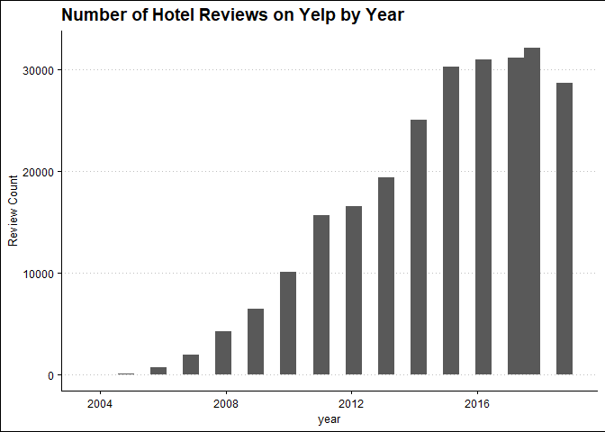<!-- -->

The Flesch–Kincaid readability tests are readability tests designed to
indicate how easily a passage is understood. The higher the score, the
more easier to understand. We will also look at the length of reviews,
according to the number of words. We will use a random sample of our
data for most analyses in order for them to run faster.

``` r
set.seed(123)
hotel_sample <- hotel_all[sample(nrow(hotel_all), size = 2500), ]

readability <- textstat_readability(hotel_sample$text)

hist(readability$Flesch, xlim = c(0, 100),breaks = 200, xlab = "Flesch-Kincaid Score", main = "Flesch-Kincaid Scores for Hotel Reviews on Yelp")
```

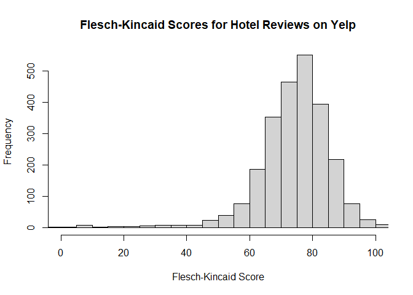<!-- -->

``` r
hist(ntoken(hotel_sample$text), breaks = 100, main = "Words per Hotel Review", xlab = "Number of Words")
```

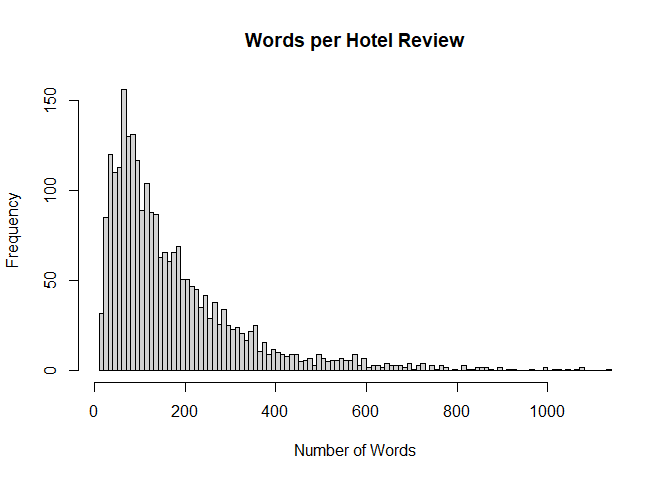<!-- -->

View reviews with less than 10 words.

``` r
hotel_sample$text[which(ntoken(hotel_sample$text) < 10)]
```

    ## character(0)

No reviews returned.

Check out possible covariate(s). We believe hotel
experiences/expectations are likely impacted by region. The Yelp
Documentation FAQs informed us that there are 10 metropolitan areas in
the dataset: Montreal, Calgary, Toronto, Pittsburgh, Charlotte,
Urbana-Champaign, Phoenix, Las Vegas, Madison, and Cleveland

``` r
hotel_all %>% group_by(state) %>% summarise(Count = n()) %>% arrange(desc(Count))
```

    ## `summarise()` ungrouping output (override with `.groups` argument)

    ## # A tibble: 13 x 2
    ##    state  Count
    ##    <chr>  <int>
    ##  1 NV    169036
    ##  2 AZ     41175
    ##  3 ON      8858
    ##  4 NC      8139
    ##  5 OH      7953
    ##  6 PA      6503
    ##  7 QC      5696
    ##  8 WI      3339
    ##  9 AB      1778
    ## 10 IL       963
    ## 11 SC       234
    ## 12 VT         5
    ## 13 NY         3

``` r
hotel_all %>% group_by(city) %>% summarise(Count = n()) %>% arrange(desc(Count))
```

    ## `summarise()` ungrouping output (override with `.groups` argument)

    ## # A tibble: 193 x 2
    ##    city        Count
    ##    <chr>       <int>
    ##  1 Las Vegas  162151
    ##  2 Phoenix     16230
    ##  3 Scottsdale  12989
    ##  4 Toronto      6869
    ##  5 Charlotte    6783
    ##  6 Henderson    5559
    ##  7 Pittsburgh   5336
    ##  8 Tempe        3872
    ##  9 Montréal    3667
    ## 10 Cleveland    3604
    ## # ... with 183 more rows

13 states were returned for 10 cities. We know SC will belong to
Charlotte, in addition to NC. Let’s investigate the cities from NY and
VT.

``` r
hotel_all %>% filter(state=="NY") %>% group_by(city) %>% summarise(Count = n()) %>% arrange(desc(Count))
```

    ## `summarise()` ungrouping output (override with `.groups` argument)

    ## # A tibble: 1 x 2
    ##   city         Count
    ##   <chr>        <int>
    ## 1 Rouses Point     3

``` r
hotel_all %>% filter(state=="VT") %>% group_by(city) %>% summarise(Count = n()) %>% arrange(desc(Count))
```

    ## `summarise()` ungrouping output (override with `.groups` argument)

    ## # A tibble: 1 x 2
    ##   city   Count
    ##   <chr>  <int>
    ## 1 Alburg     5

Update the full and sample dataframes.

``` r
hotel_all$region[hotel_all$state %in% c("NV")] <- "Las Vegas"
hotel_all$region[hotel_all$state %in% c("AZ")] <- "Phoenix"
hotel_all$region[hotel_all$state %in% c("PA")] <- "Pittsburgh"
hotel_all$region[hotel_all$state %in% c("OH")] <- "Cleveland"
hotel_all$region[hotel_all$state %in% c("WI")] <- "Madison"
hotel_all$region[hotel_all$state %in% c("IL")] <- "Urbana"
hotel_all$region[hotel_all$state %in% c("NC","SC")] <- "Charlotte"
hotel_all$region[hotel_all$state %in% c("ON")] <- "Toronto"
hotel_all$region[hotel_all$state %in% c("QC","VT","NY")] <- "Montreal"
hotel_all$region[hotel_all$state %in% c("AB")] <- "Calgary"

hotel_sample$region[hotel_sample$state %in% c("NV")] <- "Las Vegas"
hotel_sample$region[hotel_sample$state %in% c("AZ")] <- "Phoenix"
hotel_sample$region[hotel_sample$state %in% c("PA")] <- "Pittsburgh"
hotel_sample$region[hotel_sample$state %in% c("OH")] <- "Cleveland"
hotel_sample$region[hotel_sample$state %in% c("WI")] <- "Madison"
hotel_sample$region[hotel_sample$state %in% c("IL")] <- "Urbana"
hotel_sample$region[hotel_sample$state %in% c("NC","SC")] <- "Charlotte"
hotel_sample$region[hotel_sample$state %in% c("ON")] <- "Toronto"
hotel_sample$region[hotel_sample$state %in% c("QC","VT","NY")] <- "Montreal"
hotel_sample$region[hotel_sample$state %in% c("AB")] <- "Calgary"


table(hotel_all$region)
```

    ## 
    ##    Calgary  Charlotte  Cleveland  Las Vegas    Madison   Montreal    Phoenix 
    ##       1778       8373       7953     169036       3339       5704      41175 
    ## Pittsburgh    Toronto     Urbana 
    ##       6503       8858        963

Create a corpus and add region as a covariate.

``` r
text <- hotel_sample$text

myCorpus <- corpus(text)

docvars(myCorpus, "region") <- hotel_sample$region
```

Create a Document-Feature Matrix (DFM) and find the top 50 words.

``` r
dfm <- dfm(myCorpus, remove = c(stopwords("english")), ngrams = 1L, stem = F, remove_numbers = T, remove_punct = T, remove_symbols = T, remove_hyphens = F)
```

    ## Warning: 'remove_hyphens' is deprecated, use 'split_hyphens' instead.

    ## Warning: ngrams argument is not used.

``` r
topfeatures(dfm, 50)
```

    ##     room    hotel     stay      one    great     like      get     nice 
    ##     3401     2509     1439     1240     1185     1159     1140     1136 
    ##    place    rooms     just       us     time  service     good    night 
    ##     1096     1062     1056      999      996      926      907      852 
    ##    vegas   really    staff     back     pool   stayed     also    strip 
    ##      842      828      794      779      740      723      721      713 
    ##      can     even      got    clean     desk       go    front    check 
    ##      702      683      669      664      657      653      617      616 
    ##      day     food   casino     well      bed   people     area    first 
    ##      607      598      592      570      557      538      525      523 
    ##    never      two     next    floor     free bathroom     much     told 
    ##      502      459      456      453      452      435      429      428 
    ##     went   around 
    ##      427      427

We will repeat the previous step but remove additional general words and
hotel specific words that are not descriptive.

``` r
extra.stop <- c("always", "will", "can", "us", "get", "also", "much", "way", "things", "one", "make", "really", "just", "take", "lot", "even", "done", "something", "go", "sure", "makes", "every", "come", "say", "many", "often", "see", "want", "though", "without", "going", "takes", "someone", "however", "comes", "usually", "may", "thing", "making", "along", "since", "back", "similar", "goes", "put", "getting", "keep", "related", "else", "now", "seems", "hotel", "stay", "place", "room", "rooms", "stayed", "u", "didnt","got", "next", "definitely")

dfm <- dfm(myCorpus, remove = c(stopwords("english"), extra.stop), ngrams = 1L, stem = F, remove_numbers = T, remove_punct = T, remove_symbols = T, remove_hyphens = F)
```

    ## Warning: 'remove_hyphens' is deprecated, use 'split_hyphens' instead.

    ## Warning: ngrams argument is not used.

``` r
dfm <- dfm_trim(dfm, min_docfreq = 2)

topfeatures(dfm, 50)
```

    ##      great       like       nice       time    service       good      night 
    ##       1185       1159       1136        996        926        907        852 
    ##      vegas      staff       pool      strip      clean       desk      front 
    ##        842        794        740        713        664        657        617 
    ##      check        day       food     casino       well        bed     people 
    ##        616        607        598        592        570        557        538 
    ##       area      first      never        two      floor       free   bathroom 
    ##        525        523        502        459        453        452        435 
    ##       told       went     around   friendly    parking       said     pretty 
    ##        428        427        427        420        408        406        401 
    ##       view  breakfast     hotels   location      right experience     resort 
    ##        385        385        383        379        375        370        370 
    ##    staying       know     little     shower     better       love        bar 
    ##        365        359        358        353        344        342        342 
    ## everything 
    ##        341

Word Clouds:

``` r
textplot_wordcloud(dfm, scale = c(3.5, 0.75), colors = brewer.pal(8, "Dark2"), random.order = F, rot.per = 0.1, max.words = 100)
```

    ## Warning: colorsscalemax.wordsrandom.orderrot.per is deprecated; use
    ## colormin_size and max_sizemax_wordsrandom_orderrotation instead

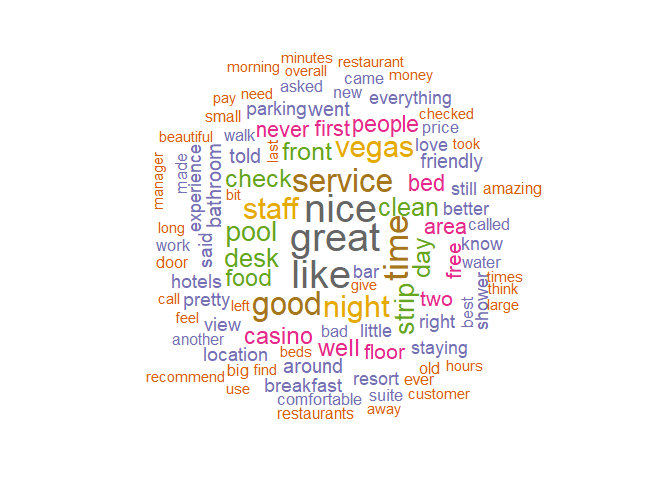<!-- -->

For a word cloud divided by region, we will view major US cities.

``` r
US_hotel_sample <- hotel_sample %>% filter(region %in% c("Charlotte","Cleveland","Las Vegas","Phoenix","Pittsburgh"))
text2 <- US_hotel_sample$text
myCorpus2 <- corpus(text2)
docvars(myCorpus2, "region") <- US_hotel_sample$region

cdfm2 <- dfm(myCorpus2, group = "region", remove = c(stopwords("english"), extra.stop), stem = F, remove_numbers = T, remove_punct = T, remove_symbols = T, remove_hyphens = F)
```

    ## Warning: 'remove_hyphens' is deprecated, use 'split_hyphens' instead.

``` r
textplot_wordcloud(cdfm2, comparison = T, scale = c(3.5, 0.75), colors = brewer.pal(8, "Dark2"), random.order = F, rot.per = 0.1, max.words = 100)
```

    ## Warning: colorsscalemax.wordsrandom.orderrot.per is deprecated; use
    ## colormin_size and max_sizemax_wordsrandom_orderrotation instead

    ## Warning in wordcloud_comparison(x, min_size, max_size, min_count, max_words, :
    ## everything could not be fit on page. It will not be plotted.

    ## Warning in wordcloud_comparison(x, min_size, max_size, min_count, max_words, :
    ## small could not be fit on page. It will not be plotted.

    ## Warning in wordcloud_comparison(x, min_size, max_size, min_count, max_words, :
    ## especially could not be fit on page. It will not be plotted.

    ## Warning in wordcloud_comparison(x, min_size, max_size, min_count, max_words, :
    ## buffet could not be fit on page. It will not be plotted.

    ## Warning in wordcloud_comparison(x, min_size, max_size, min_count, max_words, :
    ## enough could not be fit on page. It will not be plotted.

    ## Warning in wordcloud_comparison(x, min_size, max_size, min_count, max_words, :
    ## apartment could not be fit on page. It will not be plotted.

    ## Warning in wordcloud_comparison(x, min_size, max_size, min_count, max_words, :
    ## located could not be fit on page. It will not be plotted.

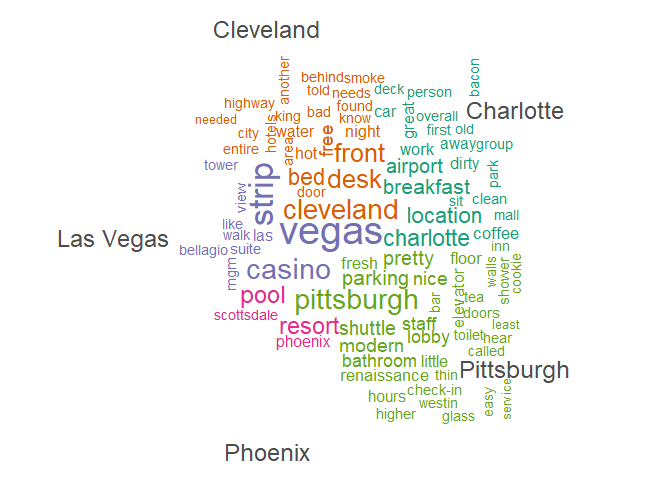<!-- -->

Words that commonly appear together:

``` r
wordDfm <- dfm_sort(dfm_weight(dfm, "frequency"))
```

    ## Warning: scheme = "frequency" is deprecated; use dfm_weight(x, scheme = "count")
    ## instead

``` r
wordDfm <- t(wordDfm)[1:50, ]
wordDistMat <- dist(wordDfm)
wordCluster <- hclust(wordDistMat)
plot(wordCluster, xlab = "", main = "Raw Frequency weighting")
```

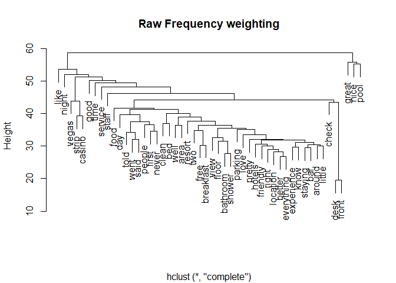<!-- -->

Same code as above except we use “TF-IDF weighting”. This reduces the
weight of words that occur very frequently (e.g. great) or very
infrequently.

``` r
wordDfm <- dfm_sort(dfm_weight(dfm, "tfidf"))
```

    ## Warning: scheme = "tfidf" is deprecated; use dfm_tfidf(x) instead

``` r
wordDfm <- t(wordDfm)[1:50, ]
wordDistMat <- dist(wordDfm)
wordCluster <- hclust(wordDistMat)
plot(wordCluster, xlab = "", main = "TF-IDF weighting")
```

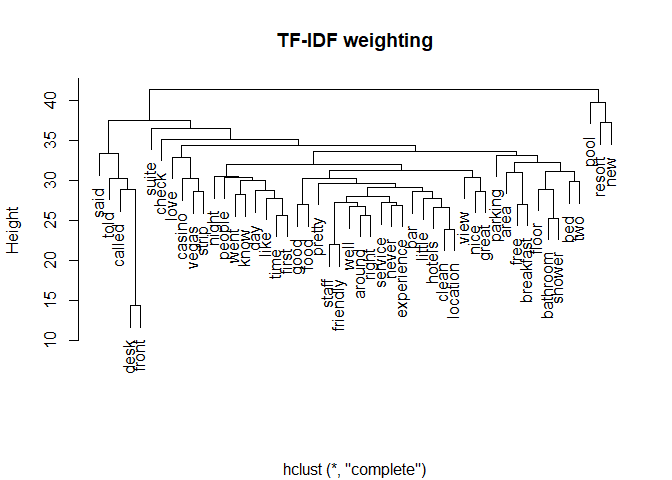<!-- -->

# Structural Topic Modeling without Covariates

``` r
library(stm)
```

    ## stm v1.3.6 successfully loaded. See ?stm for help. 
    ##  Papers, resources, and other materials at structuraltopicmodel.com

To use stm, we first need to convert to the appropriate data structure.
Then, view a plot to help determine how many times a word needs to occur
in order to keep it in our analysis

``` r
stmdfm <- convert(dfm, to = "stm", docvars = docvars(myCorpus))
plotRemoved(stmdfm$documents, lower.thresh = seq(1, 80, by = 20))
```

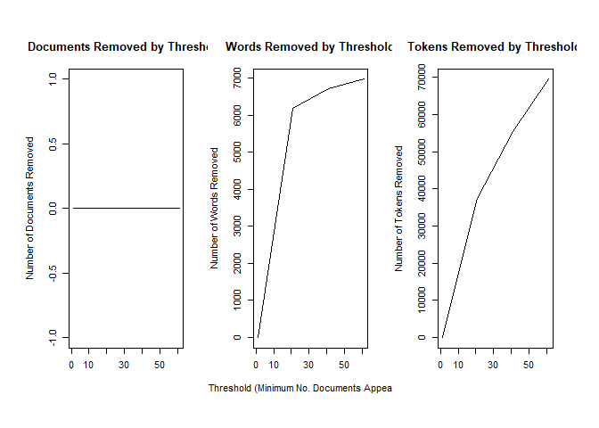<!-- -->

We will keep words that appear at least 3 times

``` r
out <- prepDocuments(stmdfm$documents, stmdfm$vocab, stmdfm$meta, lower.thresh = 3)
```

    ## Removing 3017 of 7429 terms (7041 of 131421 tokens) due to frequency 
    ## Your corpus now has 2500 documents, 4412 terms and 124380 tokens.

Choosing the optimal number of topics.

``` r
K <- c(5, 10, 15, 25, 50)
kresult <- searchK(out$documents, out$vocab, K, data = out$meta, max.em.its = 15, init.type = "Spectral")
```

    ## Beginning Spectral Initialization 
    ##   Calculating the gram matrix...
    ##   Finding anchor words...
    ##      .....
    ##   Recovering initialization...
    ##      ............................................
    ## Initialization complete.
    ## ....................................................................................................
    ## Completed E-Step (2 seconds). 
    ## Completed M-Step. 
    ## Completing Iteration 1 (approx. per word bound = -7.494) 
    ## ....................................................................................................
    ## Completed E-Step (2 seconds). 
    ## Completed M-Step. 
    ## Completing Iteration 2 (approx. per word bound = -7.438, relative change = 7.464e-03) 
    ## ....................................................................................................
    ## Completed E-Step (1 seconds). 
    ## Completed M-Step. 
    ## Completing Iteration 3 (approx. per word bound = -7.420, relative change = 2.361e-03) 
    ## ....................................................................................................
    ## Completed E-Step (1 seconds). 
    ## Completed M-Step. 
    ## Completing Iteration 4 (approx. per word bound = -7.412, relative change = 1.040e-03) 
    ## ....................................................................................................
    ## Completed E-Step (1 seconds). 
    ## Completed M-Step. 
    ## Completing Iteration 5 (approx. per word bound = -7.408, relative change = 6.244e-04) 
    ## Topic 1: front, work, made, desk, good 
    ##  Topic 2: like, strip, desk, resort, nice 
    ##  Topic 3: service, night, nice, day, casino 
    ##  Topic 4: time, good, clean, well, never 
    ##  Topic 5: great, vegas, staff, food, free 
    ## ....................................................................................................
    ## Completed E-Step (1 seconds). 
    ## Completed M-Step. 
    ## Completing Iteration 6 (approx. per word bound = -7.404, relative change = 4.698e-04) 
    ## ....................................................................................................
    ## Completed E-Step (1 seconds). 
    ## Completed M-Step. 
    ## Completing Iteration 7 (approx. per word bound = -7.401, relative change = 4.160e-04) 
    ## ....................................................................................................
    ## Completed E-Step (1 seconds). 
    ## Completed M-Step. 
    ## Completing Iteration 8 (approx. per word bound = -7.398, relative change = 4.135e-04) 
    ## ....................................................................................................
    ## Completed E-Step (1 seconds). 
    ## Completed M-Step. 
    ## Completing Iteration 9 (approx. per word bound = -7.395, relative change = 4.318e-04) 
    ## ....................................................................................................
    ## Completed E-Step (1 seconds). 
    ## Completed M-Step. 
    ## Completing Iteration 10 (approx. per word bound = -7.392, relative change = 4.617e-04) 
    ## Topic 1: front, desk, made, work, two 
    ##  Topic 2: like, strip, resort, nice, overall 
    ##  Topic 3: service, night, nice, day, casino 
    ##  Topic 4: time, good, clean, pool, well 
    ##  Topic 5: great, staff, vegas, nice, food 
    ## ....................................................................................................
    ## Completed E-Step (1 seconds). 
    ## Completed M-Step. 
    ## Completing Iteration 11 (approx. per word bound = -7.388, relative change = 5.101e-04) 
    ## ....................................................................................................
    ## Completed E-Step (1 seconds). 
    ## Completed M-Step. 
    ## Completing Iteration 12 (approx. per word bound = -7.384, relative change = 5.751e-04) 
    ## ....................................................................................................
    ## Completed E-Step (1 seconds). 
    ## Completed M-Step. 
    ## Completing Iteration 13 (approx. per word bound = -7.379, relative change = 6.470e-04) 
    ## ....................................................................................................
    ## Completed E-Step (1 seconds). 
    ## Completed M-Step. 
    ## Completing Iteration 14 (approx. per word bound = -7.374, relative change = 7.113e-04) 
    ## ....................................................................................................
    ## Completed E-Step (1 seconds). 
    ## Completed M-Step. 
    ## Model Terminated Before Convergence Reached 
    ## Beginning Spectral Initialization 
    ##   Calculating the gram matrix...
    ##   Finding anchor words...
    ##      ..........
    ##   Recovering initialization...
    ##      ............................................
    ## Initialization complete.
    ## ....................................................................................................
    ## Completed E-Step (4 seconds). 
    ## Completed M-Step. 
    ## Completing Iteration 1 (approx. per word bound = -7.427) 
    ## ....................................................................................................
    ## Completed E-Step (3 seconds). 
    ## Completed M-Step. 
    ## Completing Iteration 2 (approx. per word bound = -7.249, relative change = 2.390e-02) 
    ## ....................................................................................................
    ## Completed E-Step (2 seconds). 
    ## Completed M-Step. 
    ## Completing Iteration 3 (approx. per word bound = -7.191, relative change = 8.105e-03) 
    ## ....................................................................................................
    ## Completed E-Step (2 seconds). 
    ## Completed M-Step. 
    ## Completing Iteration 4 (approx. per word bound = -7.173, relative change = 2.385e-03) 
    ## ....................................................................................................
    ## Completed E-Step (2 seconds). 
    ## Completed M-Step. 
    ## Completing Iteration 5 (approx. per word bound = -7.165, relative change = 1.185e-03) 
    ## Topic 1: beautiful, great, service, amazing, time 
    ##  Topic 2: service, night, parking, bed, bathroom 
    ##  Topic 3: vegas, time, love, like, las 
    ##  Topic 4: time, people, pool, night, first 
    ##  Topic 5: strip, vegas, casino, great, nice 
    ##  Topic 6: nice, great, staff, clean, good 
    ##  Topic 7: food, bar, good, like, table 
    ##  Topic 8: desk, front, told, check, never 
    ##  Topic 9: like, casino, people, nice, old 
    ##  Topic 10: nice, pool, time, casino, resort 
    ## ....................................................................................................
    ## Completed E-Step (2 seconds). 
    ## Completed M-Step. 
    ## Completing Iteration 6 (approx. per word bound = -7.160, relative change = 7.291e-04) 
    ## ....................................................................................................
    ## Completed E-Step (1 seconds). 
    ## Completed M-Step. 
    ## Completing Iteration 7 (approx. per word bound = -7.156, relative change = 4.915e-04) 
    ## ....................................................................................................
    ## Completed E-Step (2 seconds). 
    ## Completed M-Step. 
    ## Completing Iteration 8 (approx. per word bound = -7.154, relative change = 3.190e-04) 
    ## ....................................................................................................
    ## Completed E-Step (1 seconds). 
    ## Completed M-Step. 
    ## Completing Iteration 9 (approx. per word bound = -7.152, relative change = 2.337e-04) 
    ## ....................................................................................................
    ## Completed E-Step (1 seconds). 
    ## Completed M-Step. 
    ## Completing Iteration 10 (approx. per word bound = -7.151, relative change = 1.939e-04) 
    ## Topic 1: great, service, beautiful, amazing, spa 
    ##  Topic 2: night, bathroom, bed, door, shower 
    ##  Topic 3: vegas, time, love, las, like 
    ##  Topic 4: people, time, pool, smoking, parking 
    ##  Topic 5: strip, vegas, casino, nice, great 
    ##  Topic 6: nice, great, clean, staff, breakfast 
    ##  Topic 7: food, good, bar, table, like 
    ##  Topic 8: desk, front, told, said, called 
    ##  Topic 9: like, people, old, casino, pool 
    ##  Topic 10: valet, resort, nice, fee, check-in 
    ## ....................................................................................................
    ## Completed E-Step (1 seconds). 
    ## Completed M-Step. 
    ## Completing Iteration 11 (approx. per word bound = -7.150, relative change = 1.631e-04) 
    ## ....................................................................................................
    ## Completed E-Step (1 seconds). 
    ## Completed M-Step. 
    ## Completing Iteration 12 (approx. per word bound = -7.149, relative change = 1.354e-04) 
    ## ....................................................................................................
    ## Completed E-Step (1 seconds). 
    ## Completed M-Step. 
    ## Completing Iteration 13 (approx. per word bound = -7.148, relative change = 1.160e-04) 
    ## ....................................................................................................
    ## Completed E-Step (1 seconds). 
    ## Completed M-Step. 
    ## Completing Iteration 14 (approx. per word bound = -7.147, relative change = 9.905e-05) 
    ## ....................................................................................................
    ## Completed E-Step (1 seconds). 
    ## Completed M-Step. 
    ## Model Terminated Before Convergence Reached 
    ## Beginning Spectral Initialization 
    ##   Calculating the gram matrix...
    ##   Finding anchor words...
    ##      ...............
    ##   Recovering initialization...
    ##      ............................................
    ## Initialization complete.
    ## ....................................................................................................
    ## Completed E-Step (7 seconds). 
    ## Completed M-Step. 
    ## Completing Iteration 1 (approx. per word bound = -7.417) 
    ## ....................................................................................................
    ## Completed E-Step (3 seconds). 
    ## Completed M-Step. 
    ## Completing Iteration 2 (approx. per word bound = -7.167, relative change = 3.376e-02) 
    ## ....................................................................................................
    ## Completed E-Step (2 seconds). 
    ## Completed M-Step. 
    ## Completing Iteration 3 (approx. per word bound = -7.116, relative change = 7.095e-03) 
    ## ....................................................................................................
    ## Completed E-Step (2 seconds). 
    ## Completed M-Step. 
    ## Completing Iteration 4 (approx. per word bound = -7.100, relative change = 2.171e-03) 
    ## ....................................................................................................
    ## Completed E-Step (3 seconds). 
    ## Completed M-Step. 
    ## Completing Iteration 5 (approx. per word bound = -7.093, relative change = 1.082e-03) 
    ## Topic 1: beautiful, amazing, great, kind, spa 
    ##  Topic 2: night, cheap, days, needed, service 
    ##  Topic 3: vegas, las, time, night, mandalay 
    ##  Topic 4: s, think, de, la, time 
    ##  Topic 5: strip, casino, vegas, love, like 
    ##  Topic 6: nice, staff, great, clean, friendly 
    ##  Topic 7: bar, like, drink, staff, people 
    ##  Topic 8: bad, never, like, night, time 
    ##  Topic 9: like, nice, bed, pool, floor 
    ##  Topic 10: fee, resort, parking, pool, nice 
    ##  Topic 11: food, great, good, service, like 
    ##  Topic 12: desk, front, told, check, called 
    ##  Topic 13: dirty, top, first, like, lost 
    ##  Topic 14: bathroom, bed, shower, night, clean 
    ##  Topic 15: parking, white, bring, black, time 
    ## ....................................................................................................
    ## Completed E-Step (3 seconds). 
    ## Completed M-Step. 
    ## Completing Iteration 6 (approx. per word bound = -7.089, relative change = 6.045e-04) 
    ## ....................................................................................................
    ## Completed E-Step (1 seconds). 
    ## Completed M-Step. 
    ## Completing Iteration 7 (approx. per word bound = -7.086, relative change = 3.525e-04) 
    ## ....................................................................................................
    ## Completed E-Step (3 seconds). 
    ## Completed M-Step. 
    ## Completing Iteration 8 (approx. per word bound = -7.084, relative change = 2.154e-04) 
    ## ....................................................................................................
    ## Completed E-Step (2 seconds). 
    ## Completed M-Step. 
    ## Completing Iteration 9 (approx. per word bound = -7.083, relative change = 1.420e-04) 
    ## ....................................................................................................
    ## Completed E-Step (2 seconds). 
    ## Completed M-Step. 
    ## Completing Iteration 10 (approx. per word bound = -7.083, relative change = 9.661e-05) 
    ## Topic 1: beautiful, amazing, spa, great, service 
    ##  Topic 2: night, cheap, days, needed, day 
    ##  Topic 3: vegas, las, time, night, mandalay 
    ##  Topic 4: s, think, la, de, time 
    ##  Topic 5: strip, casino, vegas, love, like 
    ##  Topic 6: nice, great, staff, clean, friendly 
    ##  Topic 7: bar, drink, like, people, staff 
    ##  Topic 8: bad, never, like, night, customer 
    ##  Topic 9: like, nice, bed, pool, floor 
    ##  Topic 10: fee, resort, pool, parking, wifi 
    ##  Topic 11: food, great, good, service, buffet 
    ##  Topic 12: desk, front, told, check, called 
    ##  Topic 13: dirty, broken, first, like, pool 
    ##  Topic 14: bed, bathroom, shower, night, floor 
    ##  Topic 15: parking, valet, park, garage, time 
    ## ....................................................................................................
    ## Completed E-Step (2 seconds). 
    ## Completed M-Step. 
    ## Completing Iteration 11 (approx. per word bound = -7.082, relative change = 6.629e-05) 
    ## ....................................................................................................
    ## Completed E-Step (2 seconds). 
    ## Completed M-Step. 
    ## Completing Iteration 12 (approx. per word bound = -7.082, relative change = 5.807e-05) 
    ## ....................................................................................................
    ## Completed E-Step (1 seconds). 
    ## Completed M-Step. 
    ## Completing Iteration 13 (approx. per word bound = -7.082, relative change = 5.430e-05) 
    ## ....................................................................................................
    ## Completed E-Step (2 seconds). 
    ## Completed M-Step. 
    ## Completing Iteration 14 (approx. per word bound = -7.081, relative change = 4.823e-05) 
    ## ....................................................................................................
    ## Completed E-Step (1 seconds). 
    ## Completed M-Step. 
    ## Model Terminated Before Convergence Reached 
    ## Beginning Spectral Initialization 
    ##   Calculating the gram matrix...
    ##   Finding anchor words...
    ##      .........................
    ##   Recovering initialization...
    ##      ............................................
    ## Initialization complete.
    ## ....................................................................................................
    ## Completed E-Step (7 seconds). 
    ## Completed M-Step. 
    ## Completing Iteration 1 (approx. per word bound = -7.397) 
    ## ....................................................................................................
    ## Completed E-Step (3 seconds). 
    ## Completed M-Step. 
    ## Completing Iteration 2 (approx. per word bound = -7.090, relative change = 4.149e-02) 
    ## ....................................................................................................
    ## Completed E-Step (3 seconds). 
    ## Completed M-Step. 
    ## Completing Iteration 3 (approx. per word bound = -7.019, relative change = 1.001e-02) 
    ## ....................................................................................................
    ## Completed E-Step (3 seconds). 
    ## Completed M-Step. 
    ## Completing Iteration 4 (approx. per word bound = -7.001, relative change = 2.477e-03) 
    ## ....................................................................................................
    ## Completed E-Step (3 seconds). 
    ## Completed M-Step. 
    ## Completing Iteration 5 (approx. per word bound = -6.994, relative change = 1.011e-03) 
    ## Topic 1: beautiful, bellagio, great, time, suite 
    ##  Topic 2: night, needed, cheap, days, bed 
    ##  Topic 3: vegas, las, strip, mgm, time 
    ##  Topic 4: think, s, cosmo, like, time 
    ##  Topic 5: strip, love, casino, vegas, new 
    ##  Topic 6: nice, staff, clean, friendly, pool 
    ##  Topic 7: bar, drink, like, casino, good 
    ##  Topic 8: bad, night, never, like, people 
    ##  Topic 9: like, casino, nice, kids, vegas 
    ##  Topic 10: pool, lv, resort, area, well 
    ##  Topic 11: food, great, good, service, buffet 
    ##  Topic 12: check, desk, front, told, said 
    ##  Topic 13: dirty, top, like, first, pool 
    ##  Topic 14: shower, bathroom, water, like, smell 
    ##  Topic 15: help, door, time, like, desk 
    ##  Topic 16: suite, like, service, time, bar 
    ##  Topic 17: food, good, like, delicious, night 
    ##  Topic 18: great, experience, went, time, mandalay 
    ##  Topic 19: de, la, paris, parking, que 
    ##  Topic 20: great, location, good, clean, nice 
    ##  Topic 21: bed, manager, desk, front, night 
    ##  Topic 22: best, close, strip, like, time 
    ##  Topic 23: amazing, pool, service, spa, great 
    ##  Topic 24: service, valet, customer, car, time 
    ##  Topic 25: spa, vegas, suite, nice, check 
    ## ....................................................................................................
    ## Completed E-Step (3 seconds). 
    ## Completed M-Step. 
    ## Completing Iteration 6 (approx. per word bound = -6.991, relative change = 4.814e-04) 
    ## ....................................................................................................
    ## Completed E-Step (3 seconds). 
    ## Completed M-Step. 
    ## Completing Iteration 7 (approx. per word bound = -6.990, relative change = 2.076e-04) 
    ## ....................................................................................................
    ## Completed E-Step (3 seconds). 
    ## Completed M-Step. 
    ## Completing Iteration 8 (approx. per word bound = -6.989, relative change = 1.052e-04) 
    ## ....................................................................................................
    ## Completed E-Step (2 seconds). 
    ## Completed M-Step. 
    ## Completing Iteration 9 (approx. per word bound = -6.988, relative change = 5.155e-05) 
    ## ....................................................................................................
    ## Completed E-Step (2 seconds). 
    ## Completed M-Step. 
    ## Completing Iteration 10 (approx. per word bound = -6.988, relative change = 3.227e-05) 
    ## Topic 1: beautiful, bellagio, view, suite, floor 
    ##  Topic 2: night, needed, cheap, coffee, bed 
    ##  Topic 3: vegas, las, strip, mgm, casino 
    ##  Topic 4: think, s, like, time, cosmo 
    ##  Topic 5: strip, casino, love, vegas, new 
    ##  Topic 6: nice, staff, clean, friendly, great 
    ##  Topic 7: bar, drink, casino, like, good 
    ##  Topic 8: bad, night, never, like, people 
    ##  Topic 9: like, casino, kids, nice, pool 
    ##  Topic 10: resort, pool, lv, area, well 
    ##  Topic 11: food, great, good, service, buffet 
    ##  Topic 12: desk, check, front, told, said 
    ##  Topic 13: dirty, like, top, ever, worst 
    ##  Topic 14: shower, bathroom, water, toilet, like 
    ##  Topic 15: help, door, like, time, desk 
    ##  Topic 16: suite, like, service, coffee, bar 
    ##  Topic 17: food, good, like, delicious, casino 
    ##  Topic 18: great, mandalay, experience, time, bay 
    ##  Topic 19: paris, de, la, parking, que 
    ##  Topic 20: great, location, good, clean, staff 
    ##  Topic 21: bed, manager, front, desk, told 
    ##  Topic 22: best, close, strip, time, like 
    ##  Topic 23: pool, amazing, service, resort, spa 
    ##  Topic 24: service, valet, customer, car, staff 
    ##  Topic 25: smoking, spa, vegas, suite, casino 
    ## ....................................................................................................
    ## Completed E-Step (2 seconds). 
    ## Completed M-Step. 
    ## Completing Iteration 11 (approx. per word bound = -6.988, relative change = 1.464e-05) 
    ## ....................................................................................................
    ## Completed E-Step (1 seconds). 
    ## Completed M-Step. 
    ## Completing Iteration 12 (approx. per word bound = -6.988, relative change = 1.676e-05) 
    ## ....................................................................................................
    ## Completed E-Step (1 seconds). 
    ## Completed M-Step. 
    ## Completing Iteration 13 (approx. per word bound = -6.988, relative change = 1.120e-05) 
    ## ....................................................................................................
    ## Completed E-Step (2 seconds). 
    ## Completed M-Step. 
    ## Completing Iteration 14 (approx. per word bound = -6.988, relative change = 1.519e-05) 
    ## ....................................................................................................
    ## Completed E-Step (1 seconds). 
    ## Completed M-Step. 
    ## Model Terminated Before Convergence Reached 
    ## Beginning Spectral Initialization 
    ##   Calculating the gram matrix...
    ##   Finding anchor words...
    ##      ..................................................
    ##   Recovering initialization...
    ##      ............................................
    ## Initialization complete.
    ## ....................................................................................................
    ## Completed E-Step (8 seconds). 
    ## Completed M-Step. 
    ## Completing Iteration 1 (approx. per word bound = -7.355) 
    ## ....................................................................................................
    ## Completed E-Step (4 seconds). 
    ## Completed M-Step. 
    ## Completing Iteration 2 (approx. per word bound = -6.975, relative change = 5.158e-02) 
    ## ....................................................................................................
    ## Completed E-Step (4 seconds). 
    ## Completed M-Step. 
    ## Completing Iteration 3 (approx. per word bound = -6.862, relative change = 1.627e-02) 
    ## ....................................................................................................
    ## Completed E-Step (4 seconds). 
    ## Completed M-Step. 
    ## Completing Iteration 4 (approx. per word bound = -6.828, relative change = 4.938e-03) 
    ## ....................................................................................................
    ## Completed E-Step (3 seconds). 
    ## Completed M-Step. 
    ## Completing Iteration 5 (approx. per word bound = -6.814, relative change = 2.106e-03) 
    ## Topic 1: beautiful, kind, staff, bellagio, suite 
    ##  Topic 2: cheap, needed, days, bed, night 
    ##  Topic 3: vegas, strip, las, casino, like 
    ##  Topic 4: think, s, like, time, tv 
    ##  Topic 5: strip, love, new, casino, vegas 
    ##  Topic 6: nice, staff, clean, awesome, good 
    ##  Topic 7: bar, drink, rude, like, night 
    ##  Topic 8: bad, good, night, never, desk 
    ##  Topic 9: nice, like, movie, casino, vegas 
    ##  Topic 10: simply, lv, wine, resort, star 
    ##  Topic 11: food, great, good, buffet, breakfast 
    ##  Topic 12: check, desk, front, told, early 
    ##  Topic 13: dirty, top, lost, pool, people 
    ##  Topic 14: day, shower, bathroom, breakfast, front 
    ##  Topic 15: help, told, door, bring, like 
    ##  Topic 16: update, like, international, well, resort 
    ##  Topic 17: happy, food, night, vegas, delicious 
    ##  Topic 18: experience, great, time, went, service 
    ##  Topic 19: la, de, que, el, y 
    ##  Topic 20: great, location, clean, nice, staff 
    ##  Topic 21: bed, manager, refund, front, desk 
    ##  Topic 22: best, close, strip, everything, area 
    ##  Topic 23: amazing, bartender, pool, love, beautiful 
    ##  Topic 24: valet, car, review, parking, service 
    ##  Topic 25: prices, reservation, service, strip, vegas 
    ##  Topic 26: huge, wait, suite, great, fabulous 
    ##  Topic 27: wedding, staff, time, like, better 
    ##  Topic 28: friendly, nice, staff, bed, helpful 
    ##  Topic 29: yes, day, time, like, enjoy 
    ##  Topic 30: service, customer, manager, horrible, never 
    ##  Topic 31: like, ice, night, floor, never 
    ##  Topic 32: work, still, time, night, bathroom 
    ##  Topic 33: good, play, drinks, big, area 
    ##  Topic 34: service, excellent, food, like, fantastic 
    ##  Topic 35: went, vegas, las, said, time 
    ##  Topic 36: smoking, said, told, hours, time 
    ##  Topic 37: time, loved, view, day, great 
    ##  Topic 38: disgusting, like, shower, bed, smell 
    ##  Topic 39: clean, well, breakfast, staff, friendly 
    ##  Topic 40: luxurious, great, strip, pool, time 
    ##  Topic 41: booked, night, bed, time, wish 
    ##  Topic 42: pool, great, spa, day, vegas 
    ##  Topic 43: area, gym, fitness, well, large 
    ##  Topic 44: like, price, restaurants, time, vegas 
    ##  Topic 45: time, first, location, friends, good 
    ##  Topic 46: fee, resort, charge, parking, per 
    ##  Topic 47: crab, time, food, like, great 
    ##  Topic 48: casino, people, great, like, strip 
    ##  Topic 49: line, good, casino, time, nice 
    ##  Topic 50: night, speedy, floor, super, like 
    ## ....................................................................................................
    ## Completed E-Step (4 seconds). 
    ## Completed M-Step. 
    ## Completing Iteration 6 (approx. per word bound = -6.806, relative change = 1.080e-03) 
    ## ....................................................................................................
    ## Completed E-Step (3 seconds). 
    ## Completed M-Step. 
    ## Completing Iteration 7 (approx. per word bound = -6.802, relative change = 6.502e-04) 
    ## ....................................................................................................
    ## Completed E-Step (3 seconds). 
    ## Completed M-Step. 
    ## Completing Iteration 8 (approx. per word bound = -6.799, relative change = 3.907e-04) 
    ## ....................................................................................................
    ## Completed E-Step (3 seconds). 
    ## Completed M-Step. 
    ## Completing Iteration 9 (approx. per word bound = -6.798, relative change = 2.233e-04) 
    ## ....................................................................................................
    ## Completed E-Step (3 seconds). 
    ## Completed M-Step. 
    ## Completing Iteration 10 (approx. per word bound = -6.797, relative change = 1.365e-04) 
    ## Topic 1: beautiful, kind, staff, bellagio, suite 
    ##  Topic 2: cheap, needed, days, bed, night 
    ##  Topic 3: vegas, strip, las, casino, mgm 
    ##  Topic 4: think, s, like, time, tv 
    ##  Topic 5: strip, love, new, casino, vegas 
    ##  Topic 6: nice, staff, clean, awesome, super 
    ##  Topic 7: bar, drink, like, rude, poker 
    ##  Topic 8: bad, good, night, never, sleep 
    ##  Topic 9: like, nice, movie, casino, vegas 
    ##  Topic 10: simply, lv, wine, first, star 
    ##  Topic 11: food, great, good, buffet, breakfast 
    ##  Topic 12: check, desk, front, told, early 
    ##  Topic 13: dirty, top, pool, lost, people 
    ##  Topic 14: shower, day, bathroom, front, breakfast 
    ##  Topic 15: help, told, door, bring, called 
    ##  Topic 16: update, like, international, well, resort 
    ##  Topic 17: food, night, happy, vegas, great 
    ##  Topic 18: experience, great, time, went, service 
    ##  Topic 19: la, de, que, el, y 
    ##  Topic 20: great, location, clean, staff, good 
    ##  Topic 21: bed, manager, refund, front, desk 
    ##  Topic 22: best, close, strip, area, everything 
    ##  Topic 23: amazing, bartender, beautiful, love, pool 
    ##  Topic 24: valet, car, parking, service, staff 
    ##  Topic 25: prices, reservation, vegas, price, service 
    ##  Topic 26: huge, suite, wait, tub, great 
    ##  Topic 27: wedding, staff, time, like, guests 
    ##  Topic 28: friendly, nice, staff, bed, shower 
    ##  Topic 29: yes, day, time, like, night 
    ##  Topic 30: service, customer, manager, never, said 
    ##  Topic 31: like, night, ice, floor, never 
    ##  Topic 32: work, still, time, night, bathroom 
    ##  Topic 33: good, play, drinks, area, poker 
    ##  Topic 34: service, excellent, like, food, fantastic 
    ##  Topic 35: went, vegas, las, said, time 
    ##  Topic 36: smoking, said, told, hours, time 
    ##  Topic 37: time, loved, view, day, great 
    ##  Topic 38: like, disgusting, shower, smell, bed 
    ##  Topic 39: clean, well, breakfast, staff, free 
    ##  Topic 40: luxurious, great, strip, time, pool 
    ##  Topic 41: booked, night, bed, front, suite 
    ##  Topic 42: pool, great, spa, day, area 
    ##  Topic 43: area, fitness, gym, well, large 
    ##  Topic 44: like, time, floor, good, old 
    ##  Topic 45: time, first, ph, willing, location 
    ##  Topic 46: fee, resort, charge, pay, per 
    ##  Topic 47: crab, time, food, like, great 
    ##  Topic 48: casino, great, people, like, strip 
    ##  Topic 49: line, good, casino, check-in, time 
    ##  Topic 50: night, floor, time, staying, super 
    ## ....................................................................................................
    ## Completed E-Step (3 seconds). 
    ## Completed M-Step. 
    ## Completing Iteration 11 (approx. per word bound = -6.796, relative change = 7.377e-05) 
    ## ....................................................................................................
    ## Completed E-Step (3 seconds). 
    ## Completed M-Step. 
    ## Completing Iteration 12 (approx. per word bound = -6.796, relative change = 6.791e-05) 
    ## ....................................................................................................
    ## Completed E-Step (3 seconds). 
    ## Completed M-Step. 
    ## Completing Iteration 13 (approx. per word bound = -6.796, relative change = 3.267e-05) 
    ## ....................................................................................................
    ## Completed E-Step (3 seconds). 
    ## Completed M-Step. 
    ## Completing Iteration 14 (approx. per word bound = -6.796, relative change = 1.343e-05) 
    ## ....................................................................................................
    ## Completed E-Step (2 seconds). 
    ## Completed M-Step. 
    ## Model Terminated Before Convergence Reached

``` r
plot(kresult)
```

<!-- -->

The held-out-likelihood, which is the predictive strength per model on
an out-of-sample dataset, is highest in the 5-15 range, and the
residuals are lowest in the 15-50 range. Semantic coherence is large
when the probability of words in a select topic frequently co-occur, and
we can see it’s also high in the 5-10 range. We will select 10 as our
number of topics.

Run the baseline model (without covariates)

``` r
k <- 10

stmFit <- stm(out$documents, out$vocab, K = k, max.em.its = 15, data = out$meta, init.type = "Spectral", seed = 123)
```

    ## Beginning Spectral Initialization 
    ##   Calculating the gram matrix...
    ##   Finding anchor words...
    ##      ..........
    ##   Recovering initialization...
    ##      ............................................
    ## Initialization complete.
    ## ....................................................................................................
    ## Completed E-Step (4 seconds). 
    ## Completed M-Step. 
    ## Completing Iteration 1 (approx. per word bound = -7.424) 
    ## ....................................................................................................
    ## Completed E-Step (2 seconds). 
    ## Completed M-Step. 
    ## Completing Iteration 2 (approx. per word bound = -7.234, relative change = 2.559e-02) 
    ## ....................................................................................................
    ## Completed E-Step (1 seconds). 
    ## Completed M-Step. 
    ## Completing Iteration 3 (approx. per word bound = -7.189, relative change = 6.172e-03) 
    ## ....................................................................................................
    ## Completed E-Step (1 seconds). 
    ## Completed M-Step. 
    ## Completing Iteration 4 (approx. per word bound = -7.176, relative change = 1.892e-03) 
    ## ....................................................................................................
    ## Completed E-Step (1 seconds). 
    ## Completed M-Step. 
    ## Completing Iteration 5 (approx. per word bound = -7.168, relative change = 1.060e-03) 
    ## Topic 1: service, day, resort, days, two 
    ##  Topic 2: think, service, time, two, night 
    ##  Topic 3: strip, casino, vegas, nice, like 
    ##  Topic 4: nice, staff, clean, great, friendly 
    ##  Topic 5: desk, told, front, never, said 
    ##  Topic 6: vegas, las, time, like, casino 
    ##  Topic 7: great, food, service, pool, good 
    ##  Topic 8: like, nice, bed, night, people 
    ##  Topic 9: view, time, good, food, service 
    ##  Topic 10: dirty, bathroom, bed, bad, shower 
    ## ....................................................................................................
    ## Completed E-Step (1 seconds). 
    ## Completed M-Step. 
    ## Completing Iteration 6 (approx. per word bound = -7.163, relative change = 7.130e-04) 
    ## ....................................................................................................
    ## Completed E-Step (1 seconds). 
    ## Completed M-Step. 
    ## Completing Iteration 7 (approx. per word bound = -7.159, relative change = 5.058e-04) 
    ## ....................................................................................................
    ## Completed E-Step (1 seconds). 
    ## Completed M-Step. 
    ## Completing Iteration 8 (approx. per word bound = -7.157, relative change = 3.725e-04) 
    ## ....................................................................................................
    ## Completed E-Step (0 seconds). 
    ## Completed M-Step. 
    ## Completing Iteration 9 (approx. per word bound = -7.155, relative change = 2.776e-04) 
    ## ....................................................................................................
    ## Completed E-Step (1 seconds). 
    ## Completed M-Step. 
    ## Completing Iteration 10 (approx. per word bound = -7.153, relative change = 2.076e-04) 
    ## Topic 1: resort, service, day, fee, valet 
    ##  Topic 2: wedding, staff, think, two, service 
    ##  Topic 3: strip, casino, vegas, nice, like 
    ##  Topic 4: nice, staff, clean, great, friendly 
    ##  Topic 5: desk, told, front, called, said 
    ##  Topic 6: vegas, las, time, like, casino 
    ##  Topic 7: great, food, service, pool, amazing 
    ##  Topic 8: like, nice, night, bed, people 
    ##  Topic 9: view, time, food, good, like 
    ##  Topic 10: bed, bathroom, dirty, shower, floor 
    ## ....................................................................................................
    ## Completed E-Step (1 seconds). 
    ## Completed M-Step. 
    ## Completing Iteration 11 (approx. per word bound = -7.152, relative change = 1.623e-04) 
    ## ....................................................................................................
    ## Completed E-Step (1 seconds). 
    ## Completed M-Step. 
    ## Completing Iteration 12 (approx. per word bound = -7.151, relative change = 1.364e-04) 
    ## ....................................................................................................
    ## Completed E-Step (1 seconds). 
    ## Completed M-Step. 
    ## Completing Iteration 13 (approx. per word bound = -7.150, relative change = 1.152e-04) 
    ## ....................................................................................................
    ## Completed E-Step (0 seconds). 
    ## Completed M-Step. 
    ## Completing Iteration 14 (approx. per word bound = -7.150, relative change = 9.132e-05) 
    ## ....................................................................................................
    ## Completed E-Step (1 seconds). 
    ## Completed M-Step. 
    ## Model Terminated Before Convergence Reached

View the different topics:

``` r
plot(stmFit, type = "summary", n = 5, main = "Survey Topics", text.cex = 1)
```

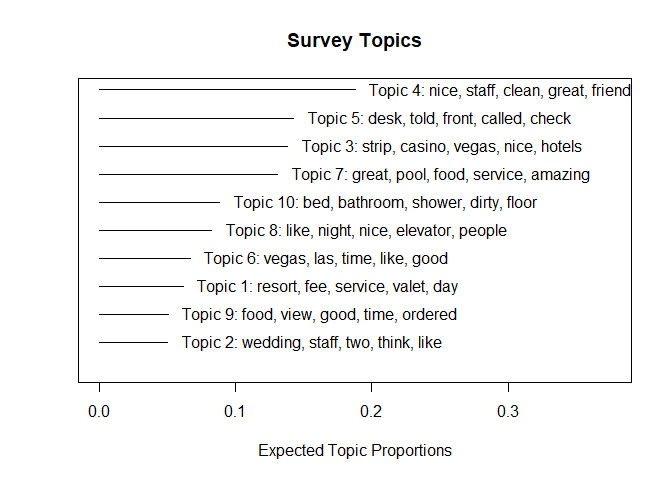<!-- -->

``` r
topic <- data.frame(topicnames = paste0("Topic ", 1:k), TopicNumber = 1:k, TopicProportions = colMeans(stmFit$theta))

topicNames <- labelTopics(stmFit)
```

We will identify the FREX weight words: FR-equently occurring and mostly
EX-clusive for its topic.

``` r
par(mfrow = c(3, 2), mar = c(1, 1, 2, 1))
for (i in 1:k) {
    plot(stmFit, type = "labels", n = 20, topics = i, main = "Raw Probabilities", 
        width = 40)
    plot(stmFit, type = "labels", n = 20, topics = i, main = "FREX Weights", labeltype = "frex", 
        width = 50)
}
```

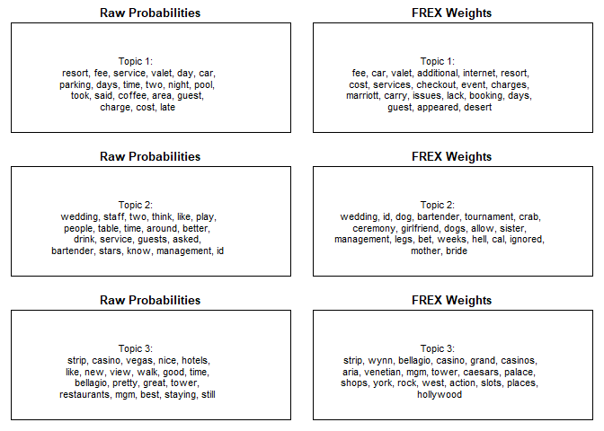<!-- -->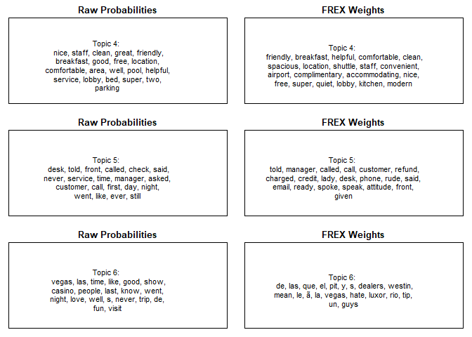<!-- -->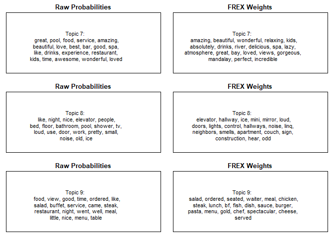<!-- -->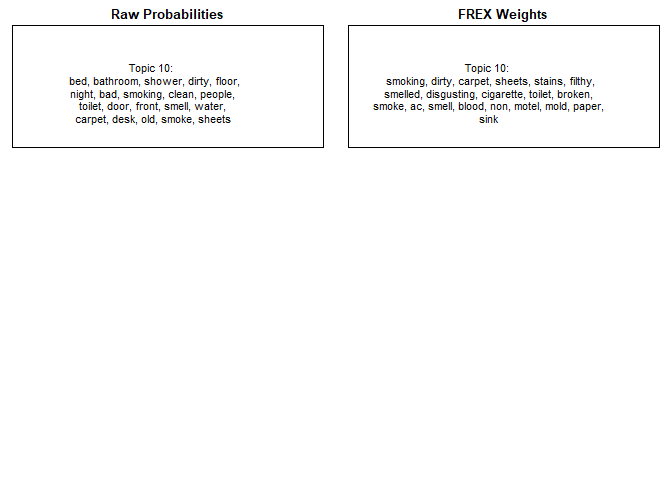<!-- -->

Plot semantic coherence and exclusivity. Semantic coherence is
essentially interpretability. The scores may be low if a topic contains
multiple subtopics. Exclusivity measures how unique words are to that
topic. The most favorable tends to be in the top right.

``` r
topicQuality(stmFit, documents = out$documents)
```

    ##  [1] -73.71420 -87.58884 -66.62291 -68.57324 -65.72036 -81.44691 -81.45524
    ##  [8] -71.40311 -98.51367 -91.61762
    ##  [1] 9.062321 8.450069 9.005558 9.654874 9.344556 8.982017 9.470792 8.603010
    ##  [9] 8.898385 9.438261

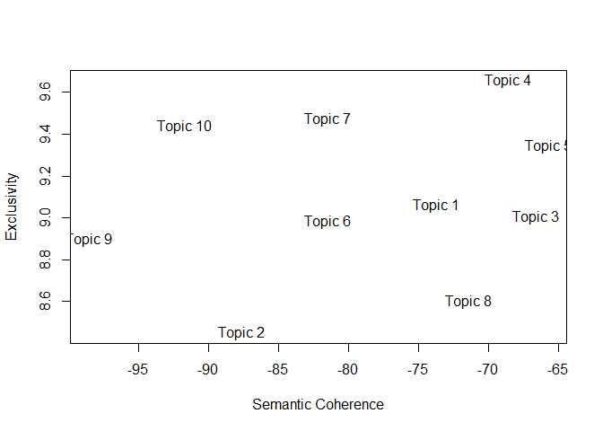<!-- -->

Topic Correlations

``` r
library(igraph)
```

    ## 
    ## Attaching package: 'igraph'

    ## The following object is masked from 'package:quanteda':
    ## 
    ##     as.igraph

    ## The following objects are masked from 'package:purrr':
    ## 
    ##     compose, simplify

    ## The following object is masked from 'package:tidyr':
    ## 
    ##     crossing

    ## The following object is masked from 'package:tibble':
    ## 
    ##     as_data_frame

    ## The following objects are masked from 'package:dplyr':
    ## 
    ##     as_data_frame, groups, union

    ## The following object is masked from 'package:R.oo':
    ## 
    ##     hierarchy

    ## The following objects are masked from 'package:stats':
    ## 
    ##     decompose, spectrum

    ## The following object is masked from 'package:base':
    ## 
    ##     union

``` r
library(visNetwork)
```

``` r
threshold <- 0.1

cormat <- cor(stmFit$theta)
adjmat <- ifelse(abs(cormat) > threshold, 1, 0)

links2 <- as.matrix(adjmat)
net2 <- graph_from_adjacency_matrix(links2, mode = "undirected")
net2 <- igraph::simplify(net2, remove.multiple = FALSE, remove.loops = TRUE)

data <- toVisNetworkData(net2)

nodes <- data[[1]]
edges <- data[[2]]
```

This code detects clusters (or communities) within the network.

``` r
clp <- cluster_label_prop(net2)
nodes$community <- clp$membership
qual_col_pals = RColorBrewer::brewer.pal.info[RColorBrewer::brewer.pal.info$category == 
    "qual", ]
col_vector = unlist(mapply(RColorBrewer::brewer.pal, qual_col_pals$maxcolors, rownames(qual_col_pals)))
col_vector <- c(col_vector, col_vector)

col <- col_vector[nodes$community + 1]

links <- igraph::as_data_frame(net2, what = "edges")
nodes <- igraph::as_data_frame(net2, what = "vertices")
```

Specify parameters on the network like shape, title, label, size and
borderwidth.

``` r
TopicProportions = colMeans(stmFit$theta)

# visNetwork preferences
nodes$shape <- "dot"
nodes$shadow <- TRUE  # Nodes will drop shadow
nodes$title <- topic$topicnames  # Text on click
nodes$label <- topic$topicnames  # Node label
nodes$size <- (TopicProportions/max(TopicProportions)) * 40  # Node size
nodes$borderWidth <- 2  # Node border width

nodes$color.background <- col
nodes$color.border <- "black"
nodes$color.highlight.background <- "orange"
nodes$color.highlight.border <- "darkred"
nodes$id <- 1:nrow(nodes)
```

``` r
screenshot.force = TRUE
visNetwork(nodes, links, width = "100%", height = "600px", main = "Topic Correlations")
```

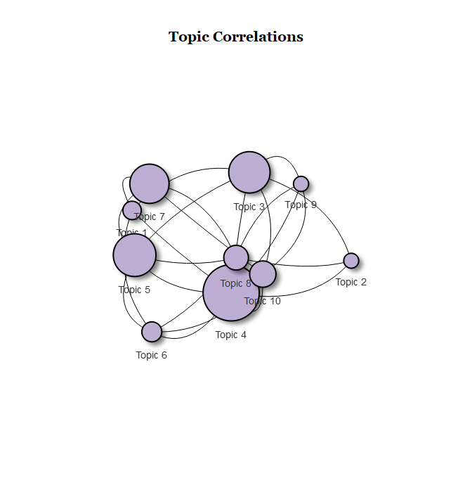<!-- -->

# Structural Topic Modeling with Covariates

``` r
stmdfm <- convert(dfm, to = "stm", docvars = docvars(myCorpus))

plotRemoved(stmdfm$documents, lower.thresh = seq(1, 80, by = 20))
```

<!-- -->

``` r
out <- prepDocuments(stmdfm$documents, stmdfm$vocab, stmdfm$meta, lower.thresh = 3)
```

    ## Removing 3017 of 7429 terms (7041 of 131421 tokens) due to frequency 
    ## Your corpus now has 2500 documents, 4412 terms and 124380 tokens.

Choosing the optimal number of topics.

``` r
K <- c(5, 10, 15, 25, 50)
kresult <- searchK(out$documents, out$vocab, K, data = out$meta, prevalence = ~region, max.em.its = 15, init.type = "Spectral")
```

    ## Beginning Spectral Initialization 
    ##   Calculating the gram matrix...
    ##   Finding anchor words...
    ##      .....
    ##   Recovering initialization...
    ##      ............................................
    ## Initialization complete.
    ## ....................................................................................................
    ## Completed E-Step (3 seconds). 
    ## Completed M-Step. 
    ## Completing Iteration 1 (approx. per word bound = -7.496) 
    ## ....................................................................................................
    ## Completed E-Step (2 seconds). 
    ## Completed M-Step. 
    ## Completing Iteration 2 (approx. per word bound = -7.437, relative change = 7.946e-03) 
    ## ....................................................................................................
    ## Completed E-Step (1 seconds). 
    ## Completed M-Step. 
    ## Completing Iteration 3 (approx. per word bound = -7.419, relative change = 2.378e-03) 
    ## ....................................................................................................
    ## Completed E-Step (1 seconds). 
    ## Completed M-Step. 
    ## Completing Iteration 4 (approx. per word bound = -7.412, relative change = 1.020e-03) 
    ## ....................................................................................................
    ## Completed E-Step (1 seconds). 
    ## Completed M-Step. 
    ## Completing Iteration 5 (approx. per word bound = -7.407, relative change = 6.015e-04) 
    ## Topic 1: service, time, experience, great, staff 
    ##  Topic 2: know, vegas, last, checked, well 
    ##  Topic 3: nice, front, clean, free, strip 
    ##  Topic 4: like, great, good, day, night 
    ##  Topic 5: people, casino, pool, around, right 
    ## ....................................................................................................
    ## Completed E-Step (1 seconds). 
    ## Completed M-Step. 
    ## Completing Iteration 6 (approx. per word bound = -7.404, relative change = 4.457e-04) 
    ## ....................................................................................................
    ## Completed E-Step (1 seconds). 
    ## Completed M-Step. 
    ## Completing Iteration 7 (approx. per word bound = -7.401, relative change = 3.856e-04) 
    ## ....................................................................................................
    ## Completed E-Step (1 seconds). 
    ## Completed M-Step. 
    ## Completing Iteration 8 (approx. per word bound = -7.398, relative change = 3.676e-04) 
    ## ....................................................................................................
    ## Completed E-Step (1 seconds). 
    ## Completed M-Step. 
    ## Completing Iteration 9 (approx. per word bound = -7.396, relative change = 3.705e-04) 
    ## ....................................................................................................
    ## Completed E-Step (1 seconds). 
    ## Completed M-Step. 
    ## Completing Iteration 10 (approx. per word bound = -7.393, relative change = 3.840e-04) 
    ## Topic 1: service, time, experience, staff, great 
    ##  Topic 2: told, know, vegas, customer, went 
    ##  Topic 3: nice, clean, front, strip, free 
    ##  Topic 4: like, great, good, day, night 
    ##  Topic 5: people, casino, pool, right, said 
    ## ....................................................................................................
    ## Completed E-Step (1 seconds). 
    ## Completed M-Step. 
    ## Completing Iteration 11 (approx. per word bound = -7.390, relative change = 4.024e-04) 
    ## ....................................................................................................
    ## Completed E-Step (1 seconds). 
    ## Completed M-Step. 
    ## Completing Iteration 12 (approx. per word bound = -7.387, relative change = 4.232e-04) 
    ## ....................................................................................................
    ## Completed E-Step (1 seconds). 
    ## Completed M-Step. 
    ## Completing Iteration 13 (approx. per word bound = -7.383, relative change = 4.445e-04) 
    ## ....................................................................................................
    ## Completed E-Step (1 seconds). 
    ## Completed M-Step. 
    ## Completing Iteration 14 (approx. per word bound = -7.380, relative change = 4.641e-04) 
    ## ....................................................................................................
    ## Completed E-Step (1 seconds). 
    ## Completed M-Step. 
    ## Model Terminated Before Convergence Reached 
    ## Beginning Spectral Initialization 
    ##   Calculating the gram matrix...
    ##   Finding anchor words...
    ##      ..........
    ##   Recovering initialization...
    ##      ............................................
    ## Initialization complete.
    ## ....................................................................................................
    ## Completed E-Step (4 seconds). 
    ## Completed M-Step. 
    ## Completing Iteration 1 (approx. per word bound = -7.422) 
    ## ....................................................................................................
    ## Completed E-Step (2 seconds). 
    ## Completed M-Step. 
    ## Completing Iteration 2 (approx. per word bound = -7.267, relative change = 2.097e-02) 
    ## ....................................................................................................
    ## Completed E-Step (1 seconds). 
    ## Completed M-Step. 
    ## Completing Iteration 3 (approx. per word bound = -7.206, relative change = 8.293e-03) 
    ## ....................................................................................................
    ## Completed E-Step (1 seconds). 
    ## Completed M-Step. 
    ## Completing Iteration 4 (approx. per word bound = -7.187, relative change = 2.614e-03) 
    ## ....................................................................................................
    ## Completed E-Step (1 seconds). 
    ## Completed M-Step. 
    ## Completing Iteration 5 (approx. per word bound = -7.178, relative change = 1.341e-03) 
    ## Topic 1: like, think, s, people, la 
    ##  Topic 2: service, food, time, like, restaurant 
    ##  Topic 3: time, night, strip, bed, good 
    ##  Topic 4: great, vegas, nice, good, pool 
    ##  Topic 5: staff, breakfast, clean, friendly, nice 
    ##  Topic 6: strip, pretty, looking, like, nice 
    ##  Topic 7: like, nice, casino, good, time 
    ##  Topic 8: desk, told, front, said, check 
    ##  Topic 9: like, time, need, people, vegas 
    ##  Topic 10: pool, spa, nice, resort, great 
    ## ....................................................................................................
    ## Completed E-Step (1 seconds). 
    ## Completed M-Step. 
    ## Completing Iteration 6 (approx. per word bound = -7.171, relative change = 8.852e-04) 
    ## ....................................................................................................
    ## Completed E-Step (1 seconds). 
    ## Completed M-Step. 
    ## Completing Iteration 7 (approx. per word bound = -7.167, relative change = 6.560e-04) 
    ## ....................................................................................................
    ## Completed E-Step (1 seconds). 
    ## Completed M-Step. 
    ## Completing Iteration 8 (approx. per word bound = -7.163, relative change = 5.053e-04) 
    ## ....................................................................................................
    ## Completed E-Step (1 seconds). 
    ## Completed M-Step. 
    ## Completing Iteration 9 (approx. per word bound = -7.160, relative change = 4.083e-04) 
    ## ....................................................................................................
    ## Completed E-Step (1 seconds). 
    ## Completed M-Step. 
    ## Completing Iteration 10 (approx. per word bound = -7.158, relative change = 3.345e-04) 
    ## Topic 1: like, think, s, people, la 
    ##  Topic 2: food, service, time, like, restaurant 
    ##  Topic 3: time, suite, bed, night, walk 
    ##  Topic 4: great, vegas, nice, good, strip 
    ##  Topic 5: breakfast, staff, clean, nice, friendly 
    ##  Topic 6: strip, like, casino, pretty, vegas 
    ##  Topic 7: like, casino, nice, good, bathroom 
    ##  Topic 8: desk, told, front, said, check 
    ##  Topic 9: like, people, time, need, night 
    ##  Topic 10: pool, spa, resort, great, nice 
    ## ....................................................................................................
    ## Completed E-Step (1 seconds). 
    ## Completed M-Step. 
    ## Completing Iteration 11 (approx. per word bound = -7.156, relative change = 2.656e-04) 
    ## ....................................................................................................
    ## Completed E-Step (1 seconds). 
    ## Completed M-Step. 
    ## Completing Iteration 12 (approx. per word bound = -7.154, relative change = 2.141e-04) 
    ## ....................................................................................................
    ## Completed E-Step (1 seconds). 
    ## Completed M-Step. 
    ## Completing Iteration 13 (approx. per word bound = -7.153, relative change = 1.810e-04) 
    ## ....................................................................................................
    ## Completed E-Step (1 seconds). 
    ## Completed M-Step. 
    ## Completing Iteration 14 (approx. per word bound = -7.152, relative change = 1.613e-04) 
    ## ....................................................................................................
    ## Completed E-Step (1 seconds). 
    ## Completed M-Step. 
    ## Model Terminated Before Convergence Reached 
    ## Beginning Spectral Initialization 
    ##   Calculating the gram matrix...
    ##   Finding anchor words...
    ##      ...............
    ##   Recovering initialization...
    ##      ............................................
    ## Initialization complete.
    ## ....................................................................................................
    ## Completed E-Step (7 seconds). 
    ## Completed M-Step. 
    ## Completing Iteration 1 (approx. per word bound = -7.417) 
    ## ....................................................................................................
    ## Completed E-Step (2 seconds). 
    ## Completed M-Step. 
    ## Completing Iteration 2 (approx. per word bound = -7.180, relative change = 3.200e-02) 
    ## ....................................................................................................
    ## Completed E-Step (2 seconds). 
    ## Completed M-Step. 
    ## Completing Iteration 3 (approx. per word bound = -7.125, relative change = 7.613e-03) 
    ## ....................................................................................................
    ## Completed E-Step (2 seconds). 
    ## Completed M-Step. 
    ## Completing Iteration 4 (approx. per word bound = -7.109, relative change = 2.247e-03) 
    ## ....................................................................................................
    ## Completed E-Step (2 seconds). 
    ## Completed M-Step. 
    ## Completing Iteration 5 (approx. per word bound = -7.100, relative change = 1.234e-03) 
    ## Topic 1: s, think, de, la, time 
    ##  Topic 2: days, service, day, two, night 
    ##  Topic 3: nice, staff, clean, friendly, good 
    ##  Topic 4: great, vegas, strip, good, casino 
    ##  Topic 5: friendly, wedding, staff, breakfast, service 
    ##  Topic 6: strip, casino, love, new, pretty 
    ##  Topic 7: like, casino, time, good, old 
    ##  Topic 8: desk, told, said, front, never 
    ##  Topic 9: need, time, valet, like, vegas 
    ##  Topic 10: great, service, beautiful, food, pool 
    ##  Topic 11: bed, night, front, desk, first 
    ##  Topic 12: view, time, great, good, food 
    ##  Topic 13: nice, like, pool, bed, area 
    ##  Topic 14: dirty, time, day, disgusting, door 
    ##  Topic 15: time, check, services, early, guest 
    ## ....................................................................................................
    ## Completed E-Step (2 seconds). 
    ## Completed M-Step. 
    ## Completing Iteration 6 (approx. per word bound = -7.095, relative change = 7.215e-04) 
    ## ....................................................................................................
    ## Completed E-Step (2 seconds). 
    ## Completed M-Step. 
    ## Completing Iteration 7 (approx. per word bound = -7.092, relative change = 5.080e-04) 
    ## ....................................................................................................
    ## Completed E-Step (2 seconds). 
    ## Completed M-Step. 
    ## Completing Iteration 8 (approx. per word bound = -7.089, relative change = 3.744e-04) 
    ## ....................................................................................................
    ## Completed E-Step (2 seconds). 
    ## Completed M-Step. 
    ## Completing Iteration 9 (approx. per word bound = -7.087, relative change = 2.865e-04) 
    ## ....................................................................................................
    ## Completed E-Step (2 seconds). 
    ## Completed M-Step. 
    ## Completing Iteration 10 (approx. per word bound = -7.085, relative change = 2.341e-04) 
    ## Topic 1: s, think, de, la, people 
    ##  Topic 2: days, day, service, two, night 
    ##  Topic 3: nice, clean, staff, breakfast, great 
    ##  Topic 4: great, vegas, strip, casino, good 
    ##  Topic 5: wedding, friendly, staff, like, breakfast 
    ##  Topic 6: strip, love, casino, new, pretty 
    ##  Topic 7: like, casino, good, time, old 
    ##  Topic 8: told, desk, said, front, called 
    ##  Topic 9: valet, need, time, like, staff 
    ##  Topic 10: great, service, beautiful, food, amazing 
    ##  Topic 11: bed, night, front, desk, first 
    ##  Topic 12: view, time, food, good, great 
    ##  Topic 13: nice, like, bed, bathroom, shower 
    ##  Topic 14: dirty, door, ever, time, day 
    ##  Topic 15: check, early, time, ready, check-in 
    ## ....................................................................................................
    ## Completed E-Step (2 seconds). 
    ## Completed M-Step. 
    ## Completing Iteration 11 (approx. per word bound = -7.084, relative change = 1.884e-04) 
    ## ....................................................................................................
    ## Completed E-Step (2 seconds). 
    ## Completed M-Step. 
    ## Completing Iteration 12 (approx. per word bound = -7.083, relative change = 1.414e-04) 
    ## ....................................................................................................
    ## Completed E-Step (2 seconds). 
    ## Completed M-Step. 
    ## Completing Iteration 13 (approx. per word bound = -7.082, relative change = 1.018e-04) 
    ## ....................................................................................................
    ## Completed E-Step (4 seconds). 
    ## Completed M-Step. 
    ## Completing Iteration 14 (approx. per word bound = -7.082, relative change = 8.814e-05) 
    ## ....................................................................................................
    ## Completed E-Step (3 seconds). 
    ## Completed M-Step. 
    ## Model Terminated Before Convergence Reached 
    ## Beginning Spectral Initialization 
    ##   Calculating the gram matrix...
    ##   Finding anchor words...
    ##      .........................
    ##   Recovering initialization...
    ##      ............................................
    ## Initialization complete.
    ## ....................................................................................................
    ## Completed E-Step (6 seconds). 
    ## Completed M-Step. 
    ## Completing Iteration 1 (approx. per word bound = -7.398) 
    ## ....................................................................................................
    ## Completed E-Step (3 seconds). 
    ## Completed M-Step. 
    ## Completing Iteration 2 (approx. per word bound = -7.089, relative change = 4.179e-02) 
    ## ....................................................................................................
    ## Completed E-Step (3 seconds). 
    ## Completed M-Step. 
    ## Completing Iteration 3 (approx. per word bound = -7.020, relative change = 9.688e-03) 
    ## ....................................................................................................
    ## Completed E-Step (3 seconds). 
    ## Completed M-Step. 
    ## Completing Iteration 4 (approx. per word bound = -7.001, relative change = 2.666e-03) 
    ## ....................................................................................................
    ## Completed E-Step (2 seconds). 
    ## Completed M-Step. 
    ## Completing Iteration 5 (approx. per word bound = -6.992, relative change = 1.273e-03) 
    ## Topic 1: think, s, people, like, time 
    ##  Topic 2: days, service, needed, night, cheap 
    ##  Topic 3: nice, staff, clean, friendly, good 
    ##  Topic 4: great, vegas, strip, staff, service 
    ##  Topic 5: friendly, staff, pool, breakfast, night 
    ##  Topic 6: strip, love, casino, new, pretty 
    ##  Topic 7: like, casino, old, night, time 
    ##  Topic 8: bad, never, night, desk, said 
    ##  Topic 9: vegas, strip, mgm, like, tower 
    ##  Topic 10: great, beautiful, service, nice, suite 
    ##  Topic 11: bed, sheets, night, time, bathroom 
    ##  Topic 12: view, time, floor, good, great 
    ##  Topic 13: nice, like, pool, area, kids 
    ##  Topic 14: dirty, disgusting, first, ever, old 
    ##  Topic 15: check, time, told, came, front 
    ##  Topic 16: fee, la, de, parking, paris 
    ##  Topic 17: door, help, time, like, desk 
    ##  Topic 18: best, good, service, area, everything 
    ##  Topic 19: great, food, good, went, service 
    ##  Topic 20: manager, desk, front, told, called 
    ##  Topic 21: amazing, pool, spa, service, food 
    ##  Topic 22: parking, location, great, strip, clean 
    ##  Topic 23: wedding, staff, event, better, service 
    ##  Topic 24: line, people, time, like, valet 
    ##  Topic 25: service, valet, parking, long, front 
    ## ....................................................................................................
    ## Completed E-Step (2 seconds). 
    ## Completed M-Step. 
    ## Completing Iteration 6 (approx. per word bound = -6.987, relative change = 7.133e-04) 
    ## ....................................................................................................
    ## Completed E-Step (2 seconds). 
    ## Completed M-Step. 
    ## Completing Iteration 7 (approx. per word bound = -6.984, relative change = 4.378e-04) 
    ## ....................................................................................................
    ## Completed E-Step (2 seconds). 
    ## Completed M-Step. 
    ## Completing Iteration 8 (approx. per word bound = -6.982, relative change = 3.012e-04) 
    ## ....................................................................................................
    ## Completed E-Step (2 seconds). 
    ## Completed M-Step. 
    ## Completing Iteration 9 (approx. per word bound = -6.981, relative change = 2.328e-04) 
    ## ....................................................................................................
    ## Completed E-Step (2 seconds). 
    ## Completed M-Step. 
    ## Completing Iteration 10 (approx. per word bound = -6.979, relative change = 1.951e-04) 
    ## Topic 1: think, s, people, like, time 
    ##  Topic 2: service, days, night, needed, two 
    ##  Topic 3: nice, clean, staff, friendly, breakfast 
    ##  Topic 4: great, vegas, strip, casino, service 
    ##  Topic 5: friendly, staff, pool, night, breakfast 
    ##  Topic 6: love, strip, casino, new, pretty 
    ##  Topic 7: like, casino, old, night, strip 
    ##  Topic 8: bad, never, night, desk, said 
    ##  Topic 9: vegas, mgm, strip, tower, nice 
    ##  Topic 10: great, beautiful, suite, decor, like 
    ##  Topic 11: bed, sheets, night, bathroom, like 
    ##  Topic 12: view, time, floor, night, bellagio 
    ##  Topic 13: nice, like, pool, area, kids 
    ##  Topic 14: dirty, ever, disgusting, first, worst 
    ##  Topic 15: check, time, told, front, desk 
    ##  Topic 16: fee, la, de, paris, parking 
    ##  Topic 17: door, help, desk, bathroom, like 
    ##  Topic 18: best, area, everything, service, quite 
    ##  Topic 19: food, good, great, service, went 
    ##  Topic 20: manager, desk, told, front, called 
    ##  Topic 21: amazing, pool, spa, service, love 
    ##  Topic 22: parking, location, walk, great, strip 
    ##  Topic 23: wedding, event, staff, guests, better 
    ##  Topic 24: line, people, valet, time, like 
    ##  Topic 25: long, staying, valet, front, never 
    ## ....................................................................................................
    ## Completed E-Step (2 seconds). 
    ## Completed M-Step. 
    ## Completing Iteration 11 (approx. per word bound = -6.978, relative change = 1.390e-04) 
    ## ....................................................................................................
    ## Completed E-Step (2 seconds). 
    ## Completed M-Step. 
    ## Completing Iteration 12 (approx. per word bound = -6.978, relative change = 9.551e-05) 
    ## ....................................................................................................
    ## Completed E-Step (2 seconds). 
    ## Completed M-Step. 
    ## Completing Iteration 13 (approx. per word bound = -6.977, relative change = 9.197e-05) 
    ## ....................................................................................................
    ## Completed E-Step (2 seconds). 
    ## Completed M-Step. 
    ## Completing Iteration 14 (approx. per word bound = -6.976, relative change = 8.468e-05) 
    ## ....................................................................................................
    ## Completed E-Step (2 seconds). 
    ## Completed M-Step. 
    ## Model Terminated Before Convergence Reached 
    ## Beginning Spectral Initialization 
    ##   Calculating the gram matrix...
    ##   Finding anchor words...
    ##      ..................................................
    ##   Recovering initialization...
    ##      ............................................
    ## Initialization complete.
    ## ....................................................................................................
    ## Completed E-Step (17 seconds). 
    ## Completed M-Step. 
    ## Completing Iteration 1 (approx. per word bound = -7.353) 
    ## ....................................................................................................
    ## Completed E-Step (6 seconds). 
    ## Completed M-Step. 
    ## Completing Iteration 2 (approx. per word bound = -6.969, relative change = 5.227e-02) 
    ## ....................................................................................................
    ## Completed E-Step (6 seconds). 
    ## Completed M-Step. 
    ## Completing Iteration 3 (approx. per word bound = -6.853, relative change = 1.659e-02) 
    ## ....................................................................................................
    ## Completed E-Step (5 seconds). 
    ## Completed M-Step. 
    ## Completing Iteration 4 (approx. per word bound = -6.819, relative change = 5.020e-03) 
    ## ....................................................................................................
    ## Completed E-Step (5 seconds). 
    ## Completed M-Step. 
    ## Completing Iteration 5 (approx. per word bound = -6.803, relative change = 2.274e-03) 
    ## Topic 1: think, like, well, first, s 
    ##  Topic 2: needed, days, cheap, good, excellent 
    ##  Topic 3: nice, staff, awesome, pool, clean 
    ##  Topic 4: vegas, great, las, hotels, strip 
    ##  Topic 5: friendly, enjoyable, staff, pool, time 
    ##  Topic 6: love, strip, new, casino, pretty 
    ##  Topic 7: like, casino, old, smell, hallways 
    ##  Topic 8: bad, desk, good, night, never 
    ##  Topic 9: vegas, luxor, like, time, strip 
    ##  Topic 10: great, beautiful, decor, nice, pretty 
    ##  Topic 11: bed, sheets, time, bathroom, clean 
    ##  Topic 12: view, simply, bellagio, time, strip 
    ##  Topic 13: nice, like, movie, kids, theater 
    ##  Topic 14: dirty, disgusting, shower, old, ever 
    ##  Topic 15: check, told, ready, came, time 
    ##  Topic 16: parking, la, dollars, paris, le 
    ##  Topic 17: door, help, time, day, find 
    ##  Topic 18: close, everything, strip, like, night 
    ##  Topic 19: went, great, experience, good, service 
    ##  Topic 20: manager, desk, front, called, told 
    ##  Topic 21: amazing, pool, bartender, service, spa 
    ##  Topic 22: parking, strip, garage, location, mall 
    ##  Topic 23: wedding, staff, like, id, time 
    ##  Topic 24: line, people, like, went, long 
    ##  Topic 25: valet, car, service, parking, review 
    ##  Topic 26: area, modern, floor, like, bathroom 
    ##  Topic 27: reservation, price, prices, first, decent 
    ##  Topic 28: gym, spa, pool, small, good 
    ##  Topic 29: best, year, time, last, good 
    ##  Topic 30: stars, desk, front, give, nice 
    ##  Topic 31: clean, great, location, staff, nice 
    ##  Topic 32: service, customer, like, rude, horrible 
    ##  Topic 33: nice, friendly, staff, bed, comfortable 
    ##  Topic 34: booked, wish, night, service, like 
    ##  Topic 35: great, plus, good, breakfast, time 
    ##  Topic 36: like, ice, night, floor, bed 
    ##  Topic 37: fee, resort, charge, coffee, day 
    ##  Topic 38: breakfast, free, good, eggs, area 
    ##  Topic 39: casino, nice, strip, restaurants, good 
    ##  Topic 40: night, credit, still, desk, card 
    ##  Topic 41: smoking, said, told, time, people 
    ##  Topic 42: strip, price, night, walk, free 
    ##  Topic 43: crab, eat, dessert, great, food 
    ##  Topic 44: night, pool, time, people, service 
    ##  Topic 45: food, good, restaurant, ordered, time 
    ##  Topic 46: clean, well, breakfast, friendly, staff 
    ##  Topic 47: like, design, desk, front, bar 
    ##  Topic 48: like, love, bellagio, shops, service 
    ##  Topic 49: fun, floor, poker, machines, super 
    ##  Topic 50: de, que, la, el, y 
    ## ....................................................................................................
    ## Completed E-Step (5 seconds). 
    ## Completed M-Step. 
    ## Completing Iteration 6 (approx. per word bound = -6.795, relative change = 1.193e-03) 
    ## ....................................................................................................
    ## Completed E-Step (5 seconds). 
    ## Completed M-Step. 
    ## Completing Iteration 7 (approx. per word bound = -6.790, relative change = 6.859e-04) 
    ## ....................................................................................................
    ## Completed E-Step (5 seconds). 
    ## Completed M-Step. 
    ## Completing Iteration 8 (approx. per word bound = -6.787, relative change = 4.457e-04) 
    ## ....................................................................................................
    ## Completed E-Step (5 seconds). 
    ## Completed M-Step. 
    ## Completing Iteration 9 (approx. per word bound = -6.785, relative change = 3.046e-04) 
    ## ....................................................................................................
    ## Completed E-Step (5 seconds). 
    ## Completed M-Step. 
    ## Completing Iteration 10 (approx. per word bound = -6.783, relative change = 2.498e-04) 
    ## Topic 1: think, like, well, first, s 
    ##  Topic 2: needed, days, cheap, day, good 
    ##  Topic 3: nice, awesome, staff, pool, super 
    ##  Topic 4: vegas, strip, las, great, hotels 
    ##  Topic 5: friendly, time, like, pool, staff 
    ##  Topic 6: love, strip, new, casino, pretty 
    ##  Topic 7: like, casino, old, smell, play 
    ##  Topic 8: bad, desk, night, good, never 
    ##  Topic 9: vegas, luxor, like, tower, time 
    ##  Topic 10: great, beautiful, decor, pretty, nice 
    ##  Topic 11: bed, sheets, time, bathroom, staying 
    ##  Topic 12: view, bellagio, time, strip, floor 
    ##  Topic 13: nice, like, movie, great, kids 
    ##  Topic 14: dirty, disgusting, shower, old, ever 
    ##  Topic 15: check, told, ready, front, desk 
    ##  Topic 16: parking, la, paris, le, dollars 
    ##  Topic 17: door, help, day, time, find 
    ##  Topic 18: close, everything, like, strip, night 
    ##  Topic 19: went, experience, great, service, good 
    ##  Topic 20: manager, desk, front, called, told 
    ##  Topic 21: amazing, pool, spa, service, bartender 
    ##  Topic 22: parking, strip, garage, location, mall 
    ##  Topic 23: wedding, staff, like, id, time 
    ##  Topic 24: line, people, like, went, long 
    ##  Topic 25: valet, car, service, parking, took 
    ##  Topic 26: area, modern, like, floor, bathroom 
    ##  Topic 27: reservation, price, like, prices, first 
    ##  Topic 28: gym, spa, pool, small, good 
    ##  Topic 29: best, year, time, last, good 
    ##  Topic 30: nice, desk, front, stars, give 
    ##  Topic 31: clean, great, location, staff, nice 
    ##  Topic 32: service, customer, like, rude, horrible 
    ##  Topic 33: nice, friendly, staff, bed, comfortable 
    ##  Topic 34: booked, wish, like, night, service 
    ##  Topic 35: great, plus, breakfast, time, good 
    ##  Topic 36: like, ice, night, floor, bed 
    ##  Topic 37: resort, fee, charge, coffee, day 
    ##  Topic 38: breakfast, good, free, eggs, area 
    ##  Topic 39: casino, nice, restaurants, strip, good 
    ##  Topic 40: night, credit, still, desk, front 
    ##  Topic 41: smoking, said, told, people, non 
    ##  Topic 42: price, strip, night, nice, walk 
    ##  Topic 43: crab, eat, great, dessert, food 
    ##  Topic 44: night, pool, time, people, service 
    ##  Topic 45: food, good, restaurant, ordered, time 
    ##  Topic 46: well, clean, breakfast, friendly, staff 
    ##  Topic 47: like, design, desk, front, bar 
    ##  Topic 48: like, bellagio, love, service, shops 
    ##  Topic 49: fun, poker, floor, games, machines 
    ##  Topic 50: de, la, que, el, y 
    ## ....................................................................................................
    ## Completed E-Step (5 seconds). 
    ## Completed M-Step. 
    ## Completing Iteration 11 (approx. per word bound = -6.782, relative change = 1.822e-04) 
    ## ....................................................................................................
    ## Completed E-Step (5 seconds). 
    ## Completed M-Step. 
    ## Completing Iteration 12 (approx. per word bound = -6.782, relative change = 1.056e-04) 
    ## ....................................................................................................
    ## Completed E-Step (5 seconds). 
    ## Completed M-Step. 
    ## Completing Iteration 13 (approx. per word bound = -6.781, relative change = 9.840e-05) 
    ## ....................................................................................................
    ## Completed E-Step (5 seconds). 
    ## Completed M-Step. 
    ## Completing Iteration 14 (approx. per word bound = -6.780, relative change = 6.768e-05) 
    ## ....................................................................................................
    ## Completed E-Step (5 seconds). 
    ## Completed M-Step. 
    ## Model Terminated Before Convergence Reached

``` r
plot(kresult)
```

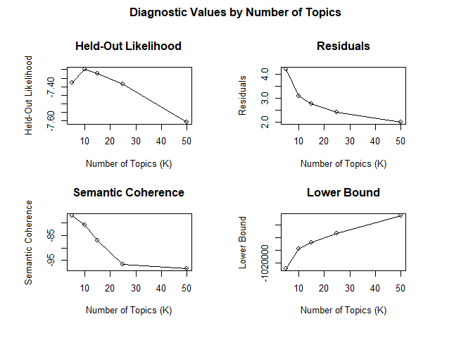<!-- -->

The optimal number of topics appear to be 10.

``` r
k <- 10

stmFit <- stm(out$documents, out$vocab, K = k, prevalence = ~region, max.em.its = 15, data = out$meta, init.type = "Spectral", seed = 123)
```

    ## Beginning Spectral Initialization 
    ##   Calculating the gram matrix...
    ##   Finding anchor words...
    ##      ..........
    ##   Recovering initialization...
    ##      ............................................
    ## Initialization complete.
    ## ....................................................................................................
    ## Completed E-Step (9 seconds). 
    ## Completed M-Step. 
    ## Completing Iteration 1 (approx. per word bound = -7.424) 
    ## ....................................................................................................
    ## Completed E-Step (3 seconds). 
    ## Completed M-Step. 
    ## Completing Iteration 2 (approx. per word bound = -7.233, relative change = 2.571e-02) 
    ## ....................................................................................................
    ## Completed E-Step (2 seconds). 
    ## Completed M-Step. 
    ## Completing Iteration 3 (approx. per word bound = -7.187, relative change = 6.357e-03) 
    ## ....................................................................................................
    ## Completed E-Step (2 seconds). 
    ## Completed M-Step. 
    ## Completing Iteration 4 (approx. per word bound = -7.173, relative change = 2.033e-03) 
    ## ....................................................................................................
    ## Completed E-Step (2 seconds). 
    ## Completed M-Step. 
    ## Completing Iteration 5 (approx. per word bound = -7.164, relative change = 1.162e-03) 
    ## Topic 1: service, day, resort, days, two 
    ##  Topic 2: think, service, time, two, night 
    ##  Topic 3: strip, casino, vegas, nice, like 
    ##  Topic 4: nice, staff, clean, great, friendly 
    ##  Topic 5: desk, told, front, never, said 
    ##  Topic 6: vegas, las, time, like, casino 
    ##  Topic 7: great, food, service, pool, good 
    ##  Topic 8: like, nice, bed, night, people 
    ##  Topic 9: view, time, good, food, service 
    ##  Topic 10: dirty, bathroom, bed, bad, shower 
    ## ....................................................................................................
    ## Completed E-Step (2 seconds). 
    ## Completed M-Step. 
    ## Completing Iteration 6 (approx. per word bound = -7.159, relative change = 7.811e-04) 
    ## ....................................................................................................
    ## Completed E-Step (2 seconds). 
    ## Completed M-Step. 
    ## Completing Iteration 7 (approx. per word bound = -7.155, relative change = 5.643e-04) 
    ## ....................................................................................................
    ## Completed E-Step (1 seconds). 
    ## Completed M-Step. 
    ## Completing Iteration 8 (approx. per word bound = -7.152, relative change = 4.124e-04) 
    ## ....................................................................................................
    ## Completed E-Step (1 seconds). 
    ## Completed M-Step. 
    ## Completing Iteration 9 (approx. per word bound = -7.149, relative change = 3.059e-04) 
    ## ....................................................................................................
    ## Completed E-Step (1 seconds). 
    ## Completed M-Step. 
    ## Completing Iteration 10 (approx. per word bound = -7.148, relative change = 2.250e-04) 
    ## Topic 1: resort, service, day, fee, valet 
    ##  Topic 2: wedding, think, staff, two, service 
    ##  Topic 3: strip, casino, vegas, nice, like 
    ##  Topic 4: nice, staff, clean, great, friendly 
    ##  Topic 5: desk, told, front, called, said 
    ##  Topic 6: vegas, las, time, like, casino 
    ##  Topic 7: great, food, service, pool, amazing 
    ##  Topic 8: like, nice, night, bed, people 
    ##  Topic 9: view, time, good, food, like 
    ##  Topic 10: bed, bathroom, dirty, shower, floor 
    ## ....................................................................................................
    ## Completed E-Step (1 seconds). 
    ## Completed M-Step. 
    ## Completing Iteration 11 (approx. per word bound = -7.147, relative change = 1.808e-04) 
    ## ....................................................................................................
    ## Completed E-Step (1 seconds). 
    ## Completed M-Step. 
    ## Completing Iteration 12 (approx. per word bound = -7.145, relative change = 1.564e-04) 
    ## ....................................................................................................
    ## Completed E-Step (1 seconds). 
    ## Completed M-Step. 
    ## Completing Iteration 13 (approx. per word bound = -7.144, relative change = 1.310e-04) 
    ## ....................................................................................................
    ## Completed E-Step (2 seconds). 
    ## Completed M-Step. 
    ## Completing Iteration 14 (approx. per word bound = -7.144, relative change = 1.039e-04) 
    ## ....................................................................................................
    ## Completed E-Step (2 seconds). 
    ## Completed M-Step. 
    ## Model Terminated Before Convergence Reached

``` r
plot(stmFit, type = "summary", xlim = c(0, 0.8), ylim = c(0.4, k + 0.4), n = 5, main = "Survey Topics", width = 10, text.cex = 1)
```

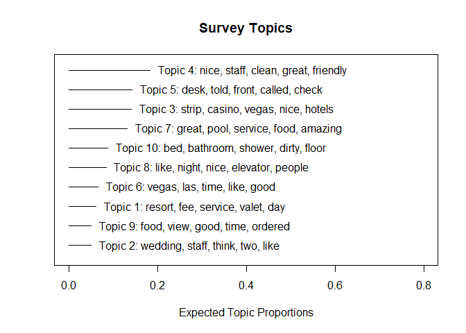<!-- -->

``` r
topic <- data.frame(topicnames = paste0("Topic ", 1:k), TopicNumber = 1:k, TopicProportions = colMeans(stmFit$theta))

topicNames <- labelTopics(stmFit)
```

``` r
par(mfrow = c(3, 2), mar = c(1, 1, 2, 1))
for (i in 1:k) {
    plot(stmFit, type = "labels", n = 25, topics = i, main = "Raw Probabilities", 
        width = 40)
    plot(stmFit, type = "labels", n = 25, topics = i, main = "FREX Weights", labeltype = "frex", 
        width = 50)
}
```

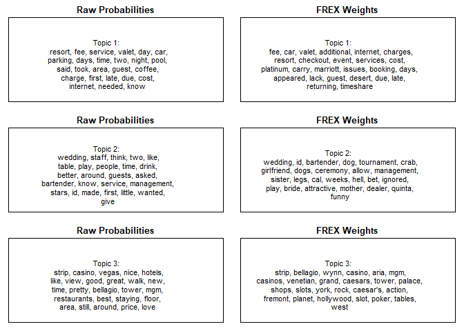<!-- -->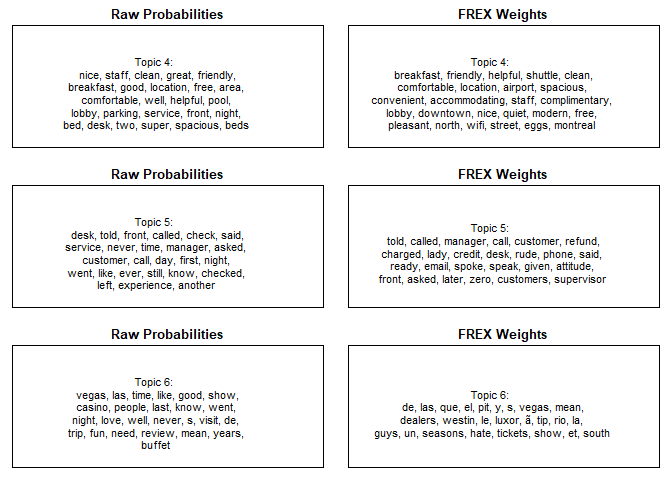<!-- -->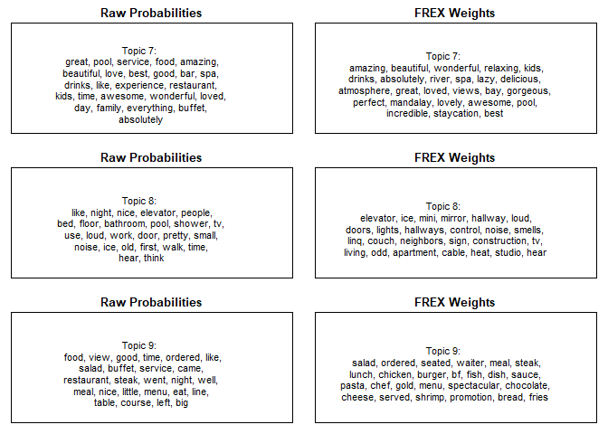<!-- -->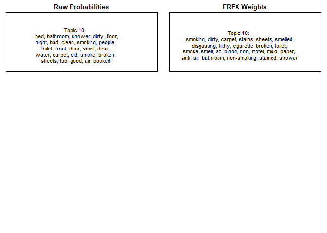<!-- -->

Let’s see the most representative review for the food category. It may
entirely be about a restaurant inside a Hotel.

``` r
shortdoc <- substr(text, 1, 800)
findThoughts(stmFit, texts = shortdoc, n = 5, topics = 9)
```

    ## 
    ##  Topic 9: 
    ##       I read a lot of reviews before eating at the Rooste.  I was worried, to say the least.  The reviews I saw were terrible.  My parents, my son and I went together at about 5:30 pm on a Monday night.  Here are the points:
    ## 1. Our waitress was attentive and very adorable.
    ## 2. We enjoyed seeing the longhorn at the front door.  He was lying down, so his odor was at a minimum.
    ## 3. The "mine" entrance was fun, and my 14 yo had just toured a mine the day before, so that made it more interesting to us.
    ## 4. My son wouldn't go down the slide, but my dad and I both slid into the restaurant.  The little kids sliding there were adorable.
    ## 5. The upstairs bar area looked nice, and had a better view, so next time I might opt to stay upstairs and just go for the appetizer menu if that's what they serve there.
    ## 6.
    ##      Kai, meaning seed in a Native American language, is a top tier fine dining restaurant. It resides inside, get this, a Sheraton. The entire dining experience feels like sitting down at a cozy fireplace for an epic retelling of some story, similar to the recent Clash of Clans advertisement with James Corden and lava pups.
    ## 
    ## The waiter had all of us hold our menus with the fronts facing the center of the table. The fronts of the menus each had different water color art, and each visual told a different story. At one point I exclaimed, "Well, I had a bean burrito for lunch," which caused everyone, including the waiter, to giggle a bit. The whole thing was a bit over the top for my taste, but I can tell why they do it.
    ## 
    ## I had the Short Story tasting menu, which I can tell you, is not short at al
    ##      Simply amazing fine dining.  It's our second time here so this review is a little overdue.  Mrs. and I went with another couple this time and it was as good as I remembered the first time.  
    ## 
    ## This latest time... we were seated on time next to one of the better paintings IMO so that started things off right.  A very large party was later seated next to us so the noise level was a little higher than usual, but not an issue at all.  We still had a great view of the fountains as well which is another great part of the setting of the room.  The paintings, the fountains, the plates, and the food really set the environment for some serious fine dining grubbing (oxymoron kinda, but I think it's fitting here, hehe).
    ## 
    ## We all did the degustation menu, 2 of us with lamb and the other 2 with fish.  I d
    ##      Always wanted to try this place out after hearing it featured on KYOT Sunday Brunch.  Can't recall how I managed a day off, but I finally found my way to see KYOT's set up at Lon's.  I did make an online reservation through opentable.com and even added a note that I would like to be seated outside near the KYOT set-up.
    ## 
    ## Arrived, mentioned my reservations, and was immediately seated INSIDE.  Waited at least ten minutes before I was given a glass of iced water.  Another 5 minutes passed by before my server introduced herself to me.  I asked if I may be seated outside since this was my main reason for dropping by- to be able to enjoy my meal outdoors, with KYOT's smooth sounds surrounding me.  I was soon placated.
    ## 
    ## Vacillated between blueberry buckwheat pancakes and Lon's burger entree.  Aske
    ##      I usually LOVE LOVE LOVE my meals at Hugo's Cellar...but this time my experience was dulled.  They were out of beef wellington, the item I MOST order and the rack of lamb, the item I was GOING to order in place of the Wellington.  The waiter (Eric) seemed embarrassed about the Wellington, and I would have appreciated if he had notified us of the outage upon our being seated, but what was most disconcerting was his lack of attention to us after our main dishes were served (I ordered the 10 oz. Filet, which was a bit on the rare side, but was corrected). After our dishes were served, the waiter seemed to 'disappear' and we were then attended to by the salad master, and the beverage support.  We will return, but will ask for an earlier seating...gotta have that Wellington !

Rename the topics based off our best attempt to summarize the FREX
weights.

``` r
topicNames <- labelTopics(stmFit)
topic <- data.frame(topicnames = c("Transactions", "Events", "Vegas Casinos", "Convenience", "Discrepancies", "Las Vegas", "Pleasant Experience", "Room Features", "Food","Complaints"), TopicNumber = 1:k, TopicProportions = colMeans(stmFit$theta), stringsAsFactors = F)
```

Plot semantic coherence and exclusivity.

``` r
topicQuality(stmFit, documents = out$documents)
```

    ##  [1] -73.71420 -97.06046 -60.74406 -67.02110 -65.72036 -81.44691 -81.45524
    ##  [8] -71.40311 -98.51367 -91.61762
    ##  [1] 9.043819 8.584621 8.876576 9.572184 9.335775 8.992503 9.478856 8.635022
    ##  [9] 8.897015 9.442375

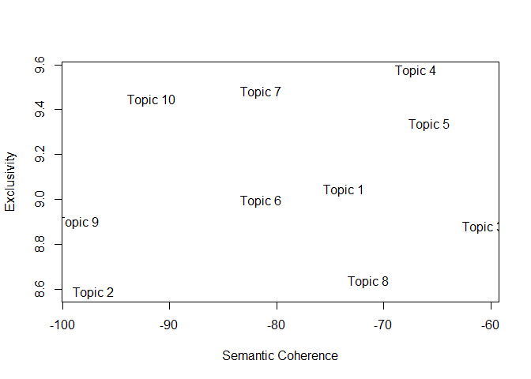<!-- -->

Find how similar words are between two topics. We will compare similar
topics (i.e. Discrepancies vs Complaints, and Convenience vs Pleasant
Experience)

``` r
plot(stmFit, type = "perspectives", topics = c(5, 10))
```

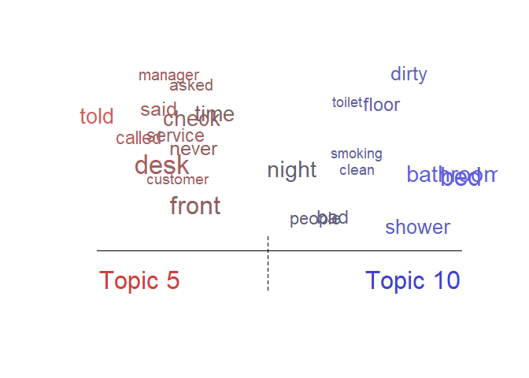<!-- -->

``` r
plot(stmFit, type = "perspectives", topics = c(4, 7))
```

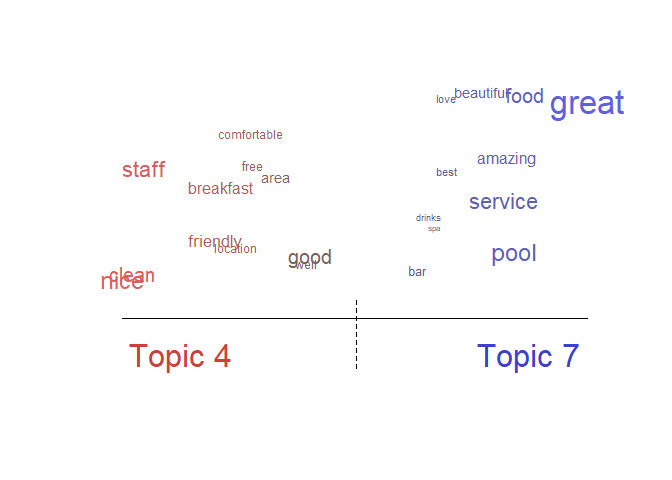<!-- -->

Topic Correlations

``` r
threshold <- 0.1

cormat <- cor(stmFit$theta)
adjmat <- ifelse(abs(cormat) > threshold, 1, 0)

links2 <- as.matrix(adjmat)
net2 <- graph_from_adjacency_matrix(links2, mode = "undirected")
net2 <- igraph::simplify(net2, remove.multiple = FALSE, remove.loops = TRUE)

data <- toVisNetworkData(net2)

nodes <- data[[1]]
edges <- data[[2]]
```

This code detects clusters (or communities) within the network.

``` r
clp <- cluster_label_prop(net2)
nodes$community <- clp$membership
qual_col_pals = RColorBrewer::brewer.pal.info[RColorBrewer::brewer.pal.info$category == 
    "qual", ]
col_vector = unlist(mapply(RColorBrewer::brewer.pal, qual_col_pals$maxcolors, rownames(qual_col_pals)))
col_vector <- c(col_vector, col_vector)

col <- col_vector[nodes$community + 1]

links <- igraph::as_data_frame(net2, what = "edges")
nodes <- igraph::as_data_frame(net2, what = "vertices")
```

Specify parameters on the network like shape, title, label, size and
borderwidth.

``` r
TopicProportions = colMeans(stmFit$theta)

# visNetwork preferences
nodes$shape <- "dot"
nodes$shadow <- TRUE  # Nodes will drop shadow
nodes$title <- topic$topicnames  # Text on click
nodes$label <- topic$topicnames  # Node label
nodes$size <- (TopicProportions/max(TopicProportions)) * 40  # Node size
nodes$borderWidth <- 2  # Node border width

nodes$color.background <- col
nodes$color.border <- "black"
nodes$color.highlight.background <- "orange"
nodes$color.highlight.border <- "darkred"
nodes$id <- 1:nrow(nodes)
```

``` r
screenshot.force = TRUE
visNetwork(nodes, links, width = "100%", height = "600px", main = "Topic Correlations")
```

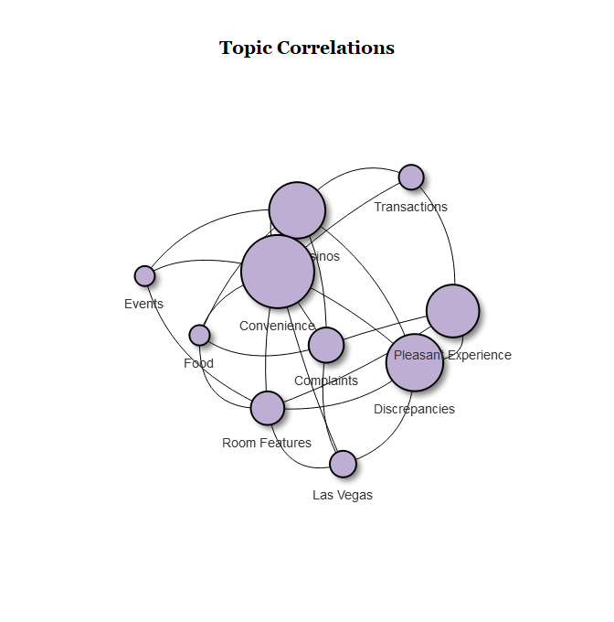<!-- -->

# Test for Ratings Change Over Time, Based off Airbnb’s Influence in the Market

``` r
library(multcomp)
```

    ## Warning: package 'multcomp' was built under R version 4.0.4

    ## Loading required package: mvtnorm

    ## Loading required package: survival

    ## Loading required package: TH.data

    ## Warning: package 'TH.data' was built under R version 4.0.4

    ## Loading required package: MASS

    ## 
    ## Attaching package: 'MASS'

    ## The following object is masked from 'package:dplyr':
    ## 
    ##     select

    ## 
    ## Attaching package: 'TH.data'

    ## The following object is masked from 'package:MASS':
    ## 
    ##     geyser

We are estimating Airbnb’s presence in the market based off the
technology adoption life cycle. The first group will be pre-airbnb,
innovators, and early adopters lumped together under the title “early
adopters”, followed by early majority, late majority, and laggards. To
determine exactly where to split the time into chunks, we referred to
several sources. The first of which, was using Google Trends to see
interest in “Airbnb” within the U.S. We then referred to
<https://www.businessofapps.com/data/airbnb-statistics/> for airbnb’s
change in revenue, number of users, bookings, and listings. In the code
below, we filtered the original dataset for reviews that mention airbnb.

``` r
airbnb <- hotels_raw %>% mutate(year = as.integer(substring(hotels_raw$date,1,4)))
airbnb <- airbnb %>% filter(grepl("airbnb",text,ignore.case = T) | grepl("air bnb",text,ignore.case = T))
airbnb %>% group_by(year) %>% ggplot(data = airbnb, mapping = aes(x = year)) + geom_histogram() + labs(y = "Count", x = "Year", title ="Number of Yelp Reviews that Mention Airbnb") + theme_clean()
```

    ## `stat_bin()` using `bins = 30`. Pick better value with `binwidth`.

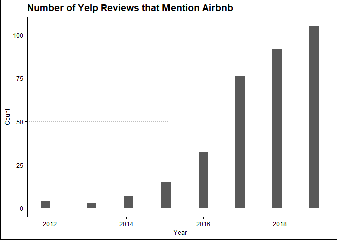<!-- -->

``` r
hotel_sample$cohort <- "Early Adopters"
hotel_sample$cohort[hotel_sample$year >= 2015 & hotel_sample$year <= 2016] <- "Early Majority"
hotel_sample$cohort[hotel_sample$year == 2017] <- "Late Majority"
hotel_sample$cohort[hotel_sample$year >= 2018] <- "Laggards"
hotel_sample$cohort <- as.factor(hotel_sample$cohort)
```

First, let’s check out a histogram for ratings, separated by cohort.

``` r
ggplot(hotel_sample, aes(x = stars.y, fill = cohort)) + geom_histogram() +
  labs(x = "stars") + facet_wrap(~cohort)
```

    ## `stat_bin()` using `bins = 30`. Pick better value with `binwidth`.

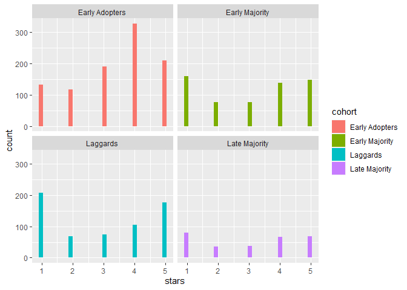<!-- -->

For each topic of interest, we will filter the dataset using the topic’s
FREX weight words. Then, we will create histograms as a check for our
assumptions. ANOVA is robust to violations of normality, given
sufficient sample size. As long as our data isn’t too skewed, we will be
safe to proceed. A boxplot to analyze variance is troublesome with only
5 unique x values (1-5 stars). Therefore, we will also use histograms to
check for variance. If our assumptions appear to be met, we will perform
an ANOVA to test for any difference in ratings across the time periods.
If the ANOVA result is significant, refer to the multiple comparisons of
means portion, in which we determine the specific time periods that
produce a difference that is statistically significant. We expect
several to return significant due to the large sample size, so we will
use Cohen’s D to measure the effect size.

Our topics of interest include those that we believe would be impacted
by Airbnb’s influence on the market. We do not believe ratings would be
significantly different for topics like “complaints”. Topics such as
“Room Features” better resemble where we predict a change in ratings.
We also excluded FREX words that have inherently strong ties with
ratings (e.g. “pleasant” would likely have very high correlation with
4-5 star ratings).

Topic 1 - Transactions

``` r
# \\b is used to identify whole words (e.g. free, but not freeze)
topic1 <- c("\\bfee\\b","\\bcar\\b","\\bvalet\\b","\\binternet\\b","\\bcharges\\b","\\bcheckout\\b","\\bservices\\b","\\bcost\\b","\\bplatinum\\b","\\bbooking\\b")
topic <- topic1

hotel_sample %>% filter(grepl(topic[1],text,ignore.case = T) | grepl(topic[2],text,ignore.case = T) | grepl(topic[3],text,ignore.case = T) | grepl(topic[4],text,ignore.case = T) | grepl(topic[5],text,ignore.case = T) | grepl(topic[6],text,ignore.case = T) | grepl(topic[7],text,ignore.case = T) | grepl(topic[8],text,ignore.case = T) | grepl(topic[9],text,ignore.case = T) | grepl(topic[10],text,ignore.case = T)) %>% ggplot(aes(x = stars.y, fill = cohort)) + geom_histogram() + labs(x = "stars") + facet_wrap(~cohort)
```

    ## `stat_bin()` using `bins = 30`. Pick better value with `binwidth`.

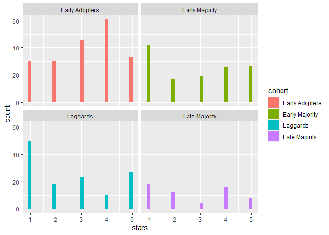<!-- -->

``` r
fit <- aov(stars.y ~ cohort, data = hotel_sample %>% filter(grepl(topic[1],text,ignore.case = T) | grepl(topic[2],text,ignore.case = T) | grepl(topic[3],text,ignore.case = T) | grepl(topic[4],text,ignore.case = T) | grepl(topic[5],text,ignore.case = T) | grepl(topic[6],text,ignore.case = T) | grepl(topic[7],text,ignore.case = T) | grepl(topic[8],text,ignore.case = T) | grepl(topic[9],text,ignore.case = T) | grepl(topic[10],text,ignore.case = T)))
summary(fit)
```

    ##              Df Sum Sq Mean Sq F value  Pr(>F)   
    ## cohort        3   31.8   10.59   4.972 0.00208 **
    ## Residuals   513 1092.6    2.13                   
    ## ---
    ## Signif. codes:  0 '***' 0.001 '**' 0.01 '*' 0.05 '.' 0.1 ' ' 1

``` r
gfit <- glht(fit, linfct = mcp("cohort" = "Tukey"))
summary(gfit, test = adjusted("bonferroni"))
```

    ## 
    ##   Simultaneous Tests for General Linear Hypotheses
    ## 
    ## Multiple Comparisons of Means: Tukey Contrasts
    ## 
    ## 
    ## Fit: aov(formula = stars.y ~ cohort, data = hotel_sample %>% filter(grepl(topic[1], 
    ##     text, ignore.case = T) | grepl(topic[2], text, ignore.case = T) | 
    ##     grepl(topic[3], text, ignore.case = T) | grepl(topic[4], 
    ##     text, ignore.case = T) | grepl(topic[5], text, ignore.case = T) | 
    ##     grepl(topic[6], text, ignore.case = T) | grepl(topic[7], 
    ##     text, ignore.case = T) | grepl(topic[8], text, ignore.case = T) | 
    ##     grepl(topic[9], text, ignore.case = T) | grepl(topic[10], 
    ##     text, ignore.case = T)))
    ## 
    ## Linear Hypotheses:
    ##                                      Estimate Std. Error t value Pr(>|t|)   
    ## Early Majority - Early Adopters == 0  -0.3453     0.1640  -2.105  0.21462   
    ## Laggards - Early Adopters == 0        -0.6069     0.1652  -3.674  0.00158 **
    ## Late Majority - Early Adopters == 0   -0.4609     0.2176  -2.117  0.20820   
    ## Laggards - Early Majority == 0        -0.2616     0.1814  -1.442  0.89924   
    ## Late Majority - Early Majority == 0   -0.1156     0.2302  -0.502  1.00000   
    ## Late Majority - Laggards == 0          0.1460     0.2310   0.632  1.00000   
    ## ---
    ## Signif. codes:  0 '***' 0.001 '**' 0.01 '*' 0.05 '.' 0.1 ' ' 1
    ## (Adjusted p values reported -- bonferroni method)

Calculate effect size(s) using Cohen’s D for Topic 1

``` r
# Laggards - Early Adopters:
0.6069/sqrt(anova(fit)['Residuals', 'Mean Sq']) #the denominator retrieves the RMSE, aka the pooled standard deviation
```

    ## [1] 0.4158594

Topic 2 - Events  
Note, this has the lowest semantic coherence/exclusivity out of all
topics

``` r
topic2 <- c("\\bwedding\\b","\\bbartender\\b","\\btournament\\b","\\bceremony\\b","\\bbride\\b","\\bid\\b","\\bcrab\\b","\\bweeks\\b","\\bmother\\b","\\bgirlfriend\\b")
topic <- topic2

hotel_sample %>% filter(grepl(topic[1],text,ignore.case = T) | grepl(topic[2],text,ignore.case = T) | grepl(topic[3],text,ignore.case = T) | grepl(topic[4],text,ignore.case = T) | grepl(topic[5],text,ignore.case = T) | grepl(topic[6],text,ignore.case = T) | grepl(topic[7],text,ignore.case = T) | grepl(topic[8],text,ignore.case = T) | grepl(topic[9],text,ignore.case = T) | grepl(topic[10],text,ignore.case = T)) %>% ggplot(aes(x = stars.y, fill = cohort)) + geom_histogram() + labs(x = "stars") + facet_wrap(~cohort)
```

    ## `stat_bin()` using `bins = 30`. Pick better value with `binwidth`.

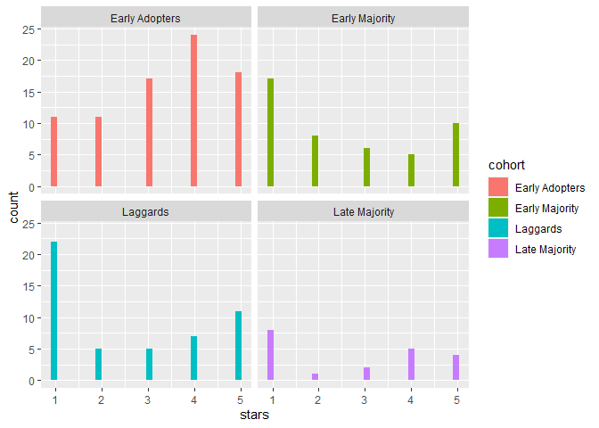<!-- -->

``` r
fit <- aov(stars.y ~ cohort, data = hotel_sample %>% filter(grepl(topic[1],text,ignore.case = T) | grepl(topic[2],text,ignore.case = T) | grepl(topic[3],text,ignore.case = T) | grepl(topic[4],text,ignore.case = T) | grepl(topic[5],text,ignore.case = T) | grepl(topic[6],text,ignore.case = T) | grepl(topic[7],text,ignore.case = T) | grepl(topic[8],text,ignore.case = T) | grepl(topic[9],text,ignore.case = T) | grepl(topic[10],text,ignore.case = T)))
summary(fit)
```

    ##              Df Sum Sq Mean Sq F value Pr(>F)  
    ## cohort        3   23.1   7.696   3.331 0.0206 *
    ## Residuals   193  445.9   2.310                 
    ## ---
    ## Signif. codes:  0 '***' 0.001 '**' 0.01 '*' 0.05 '.' 0.1 ' ' 1

``` r
gfit <- glht(fit, linfct = mcp("cohort" = "Tukey"))
summary(gfit, test = adjusted("bonferroni"))
```

    ## 
    ##   Simultaneous Tests for General Linear Hypotheses
    ## 
    ## Multiple Comparisons of Means: Tukey Contrasts
    ## 
    ## 
    ## Fit: aov(formula = stars.y ~ cohort, data = hotel_sample %>% filter(grepl(topic[1], 
    ##     text, ignore.case = T) | grepl(topic[2], text, ignore.case = T) | 
    ##     grepl(topic[3], text, ignore.case = T) | grepl(topic[4], 
    ##     text, ignore.case = T) | grepl(topic[5], text, ignore.case = T) | 
    ##     grepl(topic[6], text, ignore.case = T) | grepl(topic[7], 
    ##     text, ignore.case = T) | grepl(topic[8], text, ignore.case = T) | 
    ##     grepl(topic[9], text, ignore.case = T) | grepl(topic[10], 
    ##     text, ignore.case = T)))
    ## 
    ## Linear Hypotheses:
    ##                                      Estimate Std. Error t value Pr(>|t|)  
    ## Early Majority - Early Adopters == 0 -0.70290    0.28063  -2.505   0.0785 .
    ## Laggards - Early Adopters == 0       -0.73333    0.27337  -2.683   0.0476 *
    ## Late Majority - Early Adopters == 0  -0.53333    0.37953  -1.405   0.9694  
    ## Laggards - Early Majority == 0       -0.03043    0.31054  -0.098   1.0000  
    ## Late Majority - Early Majority == 0   0.16957    0.40712   0.416   1.0000  
    ## Late Majority - Laggards == 0         0.20000    0.40216   0.497   1.0000  
    ## ---
    ## Signif. codes:  0 '***' 0.001 '**' 0.01 '*' 0.05 '.' 0.1 ' ' 1
    ## (Adjusted p values reported -- bonferroni method)

Calculate effect size(s) using Cohen’s D for Topic 2

``` r
# Laggards - Early Adopters:
0.73333/sqrt(anova(fit)['Residuals', 'Mean Sq'])
```

    ## [1] 0.4824484

Topic 3 - Vegas Casinos

``` r
topic3 <- c("\\bstrip\\b","\\bcasino\\b","\\bcasinos\\b","\\bshops\\b","\\bslots\\b","\\baction\\b","\\bslot\\b","\\bpoker\\b","\\btables\\b","\\bfremont\\b")
topic <- topic3

hotel_sample %>% filter(grepl(topic[1],text,ignore.case = T) | grepl(topic[2],text,ignore.case = T) | grepl(topic[3],text,ignore.case = T) | grepl(topic[4],text,ignore.case = T) | grepl(topic[5],text,ignore.case = T) | grepl(topic[6],text,ignore.case = T) | grepl(topic[7],text,ignore.case = T) | grepl(topic[8],text,ignore.case = T) | grepl(topic[9],text,ignore.case = T) | grepl(topic[10],text,ignore.case = T)) %>% ggplot(aes(x = stars.y, fill = cohort)) + geom_histogram() + labs(x = "stars") + facet_wrap(~cohort)
```

    ## `stat_bin()` using `bins = 30`. Pick better value with `binwidth`.

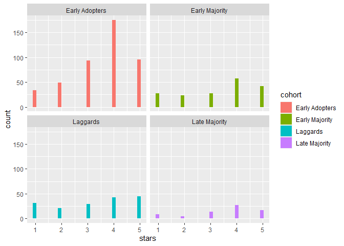<!-- -->

``` r
fit <- aov(stars.y ~ cohort, data = hotel_sample %>% filter(grepl(topic[1],text,ignore.case = T) | grepl(topic[2],text,ignore.case = T) | grepl(topic[3],text,ignore.case = T) | grepl(topic[4],text,ignore.case = T) | grepl(topic[5],text,ignore.case = T) | grepl(topic[6],text,ignore.case = T) | grepl(topic[7],text,ignore.case = T) | grepl(topic[8],text,ignore.case = T) | grepl(topic[9],text,ignore.case = T) | grepl(topic[10],text,ignore.case = T)))
summary(fit)
```

    ##              Df Sum Sq Mean Sq F value Pr(>F)  
    ## cohort        3   11.4   3.803   2.324 0.0736 .
    ## Residuals   863 1412.0   1.636                 
    ## ---
    ## Signif. codes:  0 '***' 0.001 '**' 0.01 '*' 0.05 '.' 0.1 ' ' 1

``` r
gfit <- glht(fit, linfct = mcp("cohort" = "Tukey"))
summary(gfit, test = adjusted("bonferroni"))
```

    ## 
    ##   Simultaneous Tests for General Linear Hypotheses
    ## 
    ## Multiple Comparisons of Means: Tukey Contrasts
    ## 
    ## 
    ## Fit: aov(formula = stars.y ~ cohort, data = hotel_sample %>% filter(grepl(topic[1], 
    ##     text, ignore.case = T) | grepl(topic[2], text, ignore.case = T) | 
    ##     grepl(topic[3], text, ignore.case = T) | grepl(topic[4], 
    ##     text, ignore.case = T) | grepl(topic[5], text, ignore.case = T) | 
    ##     grepl(topic[6], text, ignore.case = T) | grepl(topic[7], 
    ##     text, ignore.case = T) | grepl(topic[8], text, ignore.case = T) | 
    ##     grepl(topic[9], text, ignore.case = T) | grepl(topic[10], 
    ##     text, ignore.case = T)))
    ## 
    ## Linear Hypotheses:
    ##                                      Estimate Std. Error t value Pr(>|t|)
    ## Early Majority - Early Adopters == 0 -0.20972    0.11333  -1.850    0.388
    ## Laggards - Early Adopters == 0       -0.26218    0.11547  -2.270    0.141
    ## Late Majority - Early Adopters == 0  -0.03026    0.16241  -0.186    1.000
    ## Laggards - Early Majority == 0       -0.05246    0.13738  -0.382    1.000
    ## Late Majority - Early Majority == 0   0.17946    0.17865   1.005    1.000
    ## Late Majority - Laggards == 0         0.23192    0.18002   1.288    1.000
    ## (Adjusted p values reported -- bonferroni method)

We failed to reject the null for the initial ANOVA test (p-value 0.0736)
and cannot proceed for Topic 3.

Topic 4 - Convenience

``` r
topic4 <- c("\\bbreakfast\\b","\\bshuttle\\b","\\blocation\\b","\\bairport\\b","\\bwifi\\b","\\bdowntown\\b","\\bstaff\\b","\\bstreet\\b","\\blobby\\b","\\bcomplimentary\\b")
topic <- topic4

hotel_sample %>% filter(grepl(topic[1],text,ignore.case = T) | grepl(topic[2],text,ignore.case = T) | grepl(topic[3],text,ignore.case = T) | grepl(topic[4],text,ignore.case = T) | grepl(topic[5],text,ignore.case = T) | grepl(topic[6],text,ignore.case = T) | grepl(topic[7],text,ignore.case = T) | grepl(topic[8],text,ignore.case = T) | grepl(topic[9],text,ignore.case = T) | grepl(topic[10],text,ignore.case = T)) %>% ggplot(aes(x = stars.y, fill = cohort)) + geom_histogram() + labs(x = "stars") + facet_wrap(~cohort)
```

    ## `stat_bin()` using `bins = 30`. Pick better value with `binwidth`.

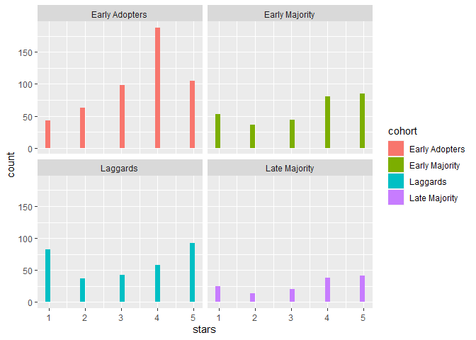<!-- -->

``` r
fit <- aov(stars.y ~ cohort, data = hotel_sample %>% filter(grepl(topic[1],text,ignore.case = T) | grepl(topic[2],text,ignore.case = T) | grepl(topic[3],text,ignore.case = T) | grepl(topic[4],text,ignore.case = T) | grepl(topic[5],text,ignore.case = T) | grepl(topic[6],text,ignore.case = T) | grepl(topic[7],text,ignore.case = T) | grepl(topic[8],text,ignore.case = T) | grepl(topic[9],text,ignore.case = T) | grepl(topic[10],text,ignore.case = T)))
summary(fit)
```

    ##               Df Sum Sq Mean Sq F value  Pr(>F)   
    ## cohort         3   26.6   8.852   4.533 0.00362 **
    ## Residuals   1244 2429.1   1.953                   
    ## ---
    ## Signif. codes:  0 '***' 0.001 '**' 0.01 '*' 0.05 '.' 0.1 ' ' 1

``` r
gfit <- glht(fit, linfct = mcp("cohort" = "Tukey"))
summary(gfit, test = adjusted("bonferroni"))
```

    ## 
    ##   Simultaneous Tests for General Linear Hypotheses
    ## 
    ## Multiple Comparisons of Means: Tukey Contrasts
    ## 
    ## 
    ## Fit: aov(formula = stars.y ~ cohort, data = hotel_sample %>% filter(grepl(topic[1], 
    ##     text, ignore.case = T) | grepl(topic[2], text, ignore.case = T) | 
    ##     grepl(topic[3], text, ignore.case = T) | grepl(topic[4], 
    ##     text, ignore.case = T) | grepl(topic[5], text, ignore.case = T) | 
    ##     grepl(topic[6], text, ignore.case = T) | grepl(topic[7], 
    ##     text, ignore.case = T) | grepl(topic[8], text, ignore.case = T) | 
    ##     grepl(topic[9], text, ignore.case = T) | grepl(topic[10], 
    ##     text, ignore.case = T)))
    ## 
    ## Linear Hypotheses:
    ##                                      Estimate Std. Error t value Pr(>|t|)   
    ## Early Majority - Early Adopters == 0 -0.13646    0.10227  -1.334  1.00000   
    ## Laggards - Early Adopters == 0       -0.36960    0.10093  -3.662  0.00157 **
    ## Late Majority - Early Adopters == 0  -0.08672    0.13370  -0.649  1.00000   
    ## Laggards - Early Majority == 0       -0.23314    0.11309  -2.062  0.23675   
    ## Late Majority - Early Majority == 0   0.04974    0.14310   0.348  1.00000   
    ## Late Majority - Laggards == 0         0.28288    0.14215   1.990  0.28085   
    ## ---
    ## Signif. codes:  0 '***' 0.001 '**' 0.01 '*' 0.05 '.' 0.1 ' ' 1
    ## (Adjusted p values reported -- bonferroni method)

Calculate effect size(s) using Cohen’s D for Topic 4

``` r
# Laggards - Early Adopters:
0.36960/sqrt(anova(fit)['Residuals', 'Mean Sq'])
```

    ## [1] 0.2644964

Topic 8 - Room Features

``` r
topic8 <- c("\\belevator\\b","\\bice\\b","\\bmini\\b","\\bmirror\\b","\\bhallways\\b","\\bcouch\\b","\\btv\\b","\\bcable\\b","\\blights\\b","\\bdoors\\b")
topic <- topic8

hotel_sample %>% filter(grepl(topic[1],text,ignore.case = T) | grepl(topic[2],text,ignore.case = T) | grepl(topic[3],text,ignore.case = T) | grepl(topic[4],text,ignore.case = T) | grepl(topic[5],text,ignore.case = T) | grepl(topic[6],text,ignore.case = T) | grepl(topic[7],text,ignore.case = T) | grepl(topic[8],text,ignore.case = T) | grepl(topic[9],text,ignore.case = T) | grepl(topic[10],text,ignore.case = T)) %>% ggplot(aes(x = stars.y, fill = cohort)) + geom_histogram() + labs(x = "stars") + facet_wrap(~cohort)
```

    ## `stat_bin()` using `bins = 30`. Pick better value with `binwidth`.

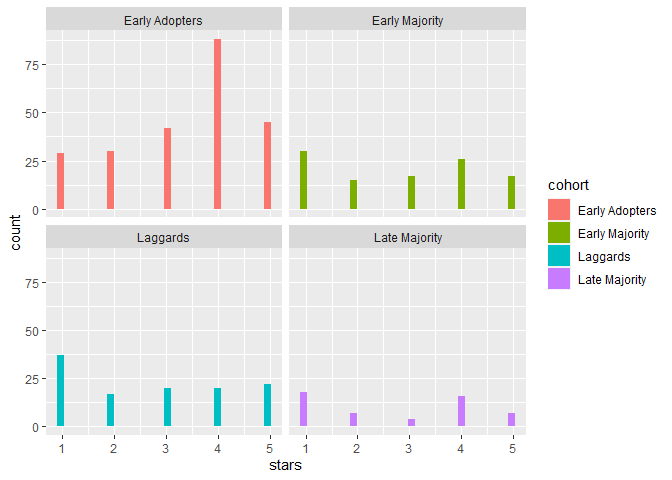<!-- -->

``` r
fit <- aov(stars.y ~ cohort, data = hotel_sample %>% filter(grepl(topic[1],text,ignore.case = T) | grepl(topic[2],text,ignore.case = T) | grepl(topic[3],text,ignore.case = T) | grepl(topic[4],text,ignore.case = T) | grepl(topic[5],text,ignore.case = T) | grepl(topic[6],text,ignore.case = T) | grepl(topic[7],text,ignore.case = T) | grepl(topic[8],text,ignore.case = T) | grepl(topic[9],text,ignore.case = T) | grepl(topic[10],text,ignore.case = T)))
summary(fit)
```

    ##              Df Sum Sq Mean Sq F value   Pr(>F)    
    ## cohort        3   43.9  14.626   7.411 7.26e-05 ***
    ## Residuals   503  992.7   1.974                     
    ## ---
    ## Signif. codes:  0 '***' 0.001 '**' 0.01 '*' 0.05 '.' 0.1 ' ' 1

``` r
gfit <- glht(fit, linfct = mcp("cohort" = "Tukey"))
summary(gfit, test = adjusted("bonferroni"))
```

    ## 
    ##   Simultaneous Tests for General Linear Hypotheses
    ## 
    ## Multiple Comparisons of Means: Tukey Contrasts
    ## 
    ## 
    ## Fit: aov(formula = stars.y ~ cohort, data = hotel_sample %>% filter(grepl(topic[1], 
    ##     text, ignore.case = T) | grepl(topic[2], text, ignore.case = T) | 
    ##     grepl(topic[3], text, ignore.case = T) | grepl(topic[4], 
    ##     text, ignore.case = T) | grepl(topic[5], text, ignore.case = T) | 
    ##     grepl(topic[6], text, ignore.case = T) | grepl(topic[7], 
    ##     text, ignore.case = T) | grepl(topic[8], text, ignore.case = T) | 
    ##     grepl(topic[9], text, ignore.case = T) | grepl(topic[10], 
    ##     text, ignore.case = T)))
    ## 
    ## Linear Hypotheses:
    ##                                      Estimate Std. Error t value Pr(>|t|)    
    ## Early Majority - Early Adopters == 0 -0.52747    0.16502  -3.197 0.008871 ** 
    ## Laggards - Early Adopters == 0       -0.61737    0.15952  -3.870 0.000739 ***
    ## Late Majority - Early Adopters == 0  -0.63462    0.21538  -2.947 0.020176 *  
    ## Laggards - Early Majority == 0       -0.08990    0.18923  -0.475 1.000000    
    ## Late Majority - Early Majority == 0  -0.10714    0.23822  -0.450 1.000000    
    ## Late Majority - Laggards == 0        -0.01724    0.23445  -0.074 1.000000    
    ## ---
    ## Signif. codes:  0 '***' 0.001 '**' 0.01 '*' 0.05 '.' 0.1 ' ' 1
    ## (Adjusted p values reported -- bonferroni method)

Calculate effect size(s) using Cohen’s D for Topic 8

``` r
# Early Majority - Early Adopters:
0.52747/sqrt(anova(fit)['Residuals', 'Mean Sq'])
```

    ## [1] 0.3754665

``` r
# Laggards - Early Adopters:
0.61737/sqrt(anova(fit)['Residuals', 'Mean Sq'])
```

    ## [1] 0.4394596

``` r
# Late Majority - Early Adopters:
0.63462 /sqrt(anova(fit)['Residuals', 'Mean Sq'])
```

    ## [1] 0.4517385

Some Limitations:  
\-Vegas has such a large proportion of total reviews that the selected
topics could be biased.  
\-We analyzed correlation, not causation of Airbnbs’s influence. Other
similar external factors that could have an impact include Airbnb rivals
(e.g. Expedia Group, Tripadvisor, Bookings Holdings).  
\-There could also be a general shift in how users express their
thoughts (e.g. users leave more polarizing reviews now compared to 10
years ago).
